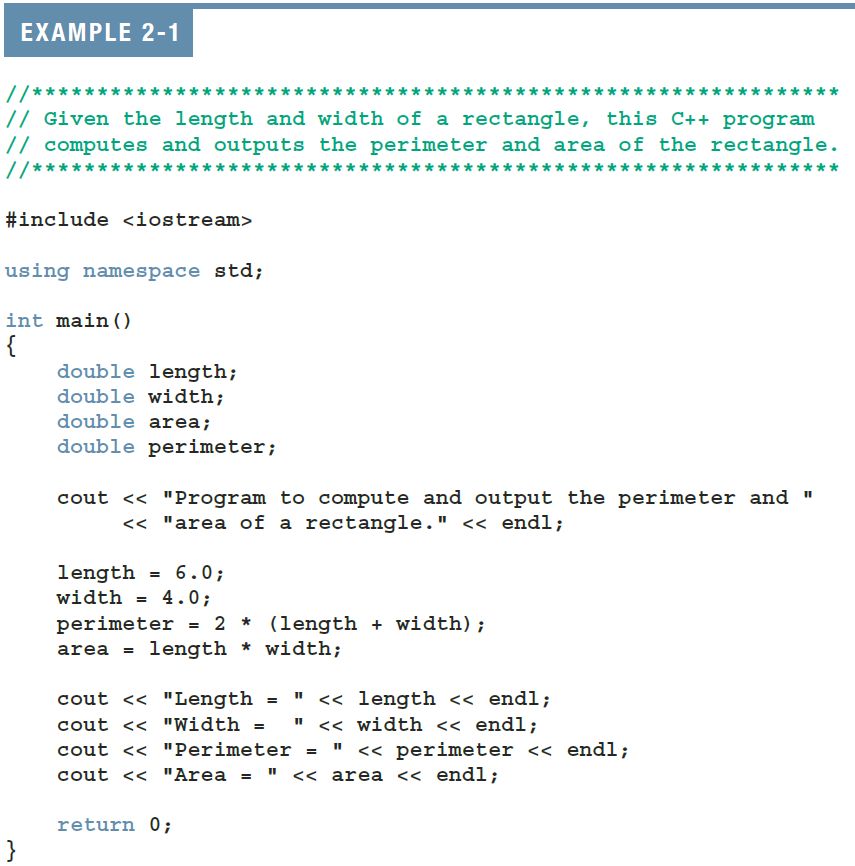
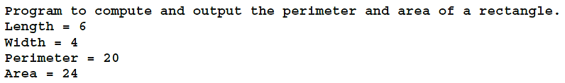
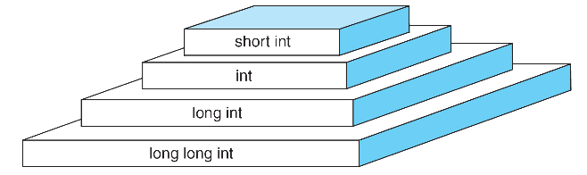
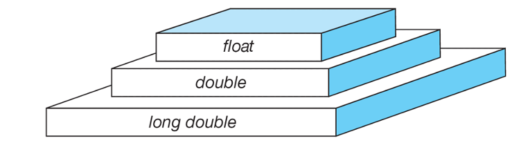
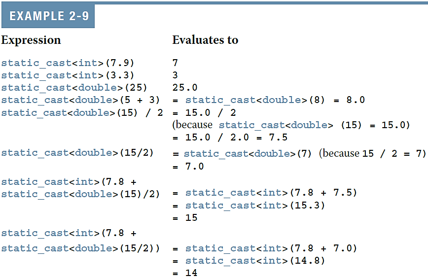
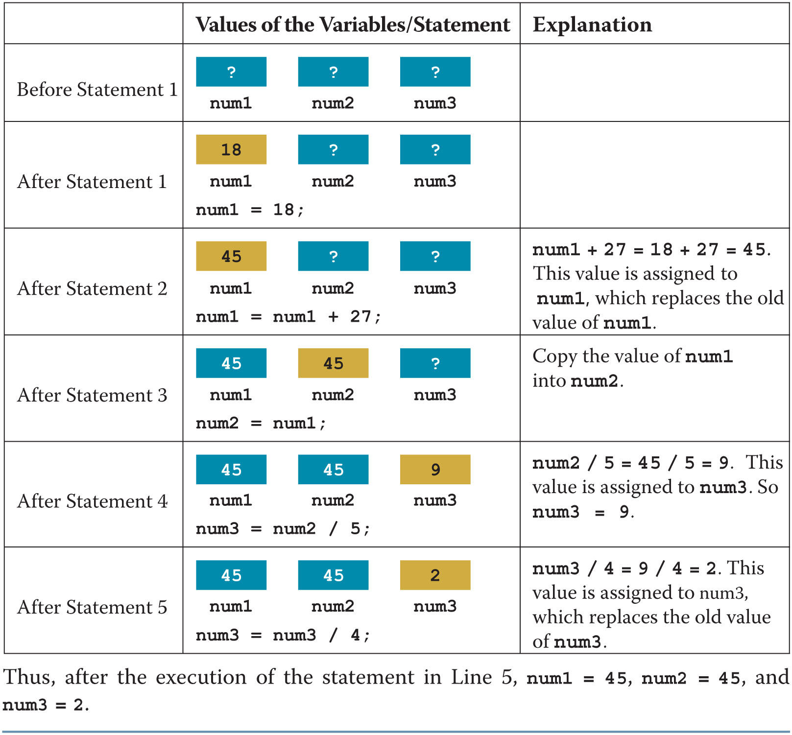
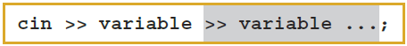
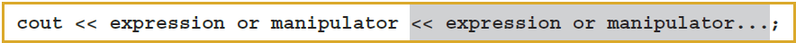
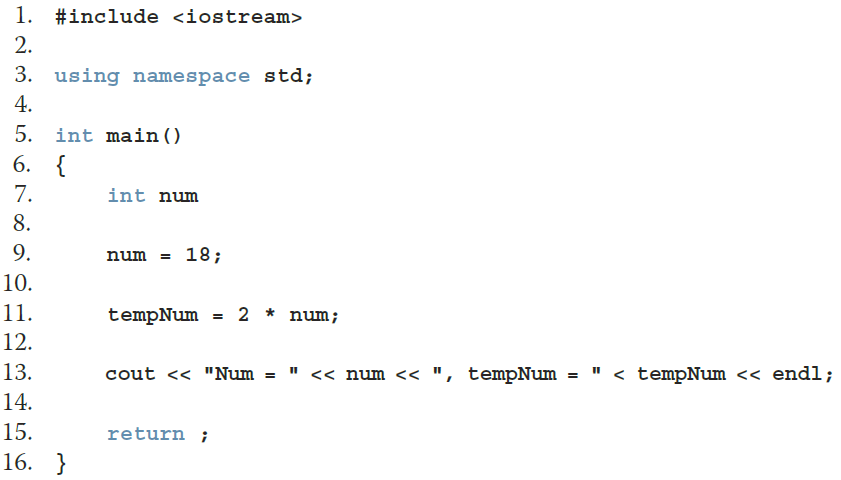

## Objectives{.allowframebreaks}

In this chapter, you will:

- Become familiar with the basic components of a C++ program, including functions, special symbols, and identifiers
- Explore simple data types
- Discover how to use arithmetic operators
- Examine how a program evaluates arithmetic expressions
- Become familiar with the `string` data type
- Learn what an assignment statement is and what it does
- Learn about variable declaration
- Discover how to input data into memory using input statements
- Become familiar with the use of increment and decrement operators
- Examine ways to output results using output statements
- Learn how to use preprocessor directives and why they are necessary
- Learn how to debug syntax errors
- Explore how to properly structure a program, including using comments to document a program
- Become familiar with compound statements
- Learn how to write a C++ program

## Introduction

- **Computer program**
    - A sequence of statements whose objective is to accomplish a task
- **Programming**
    - The process of planning and creating a program
- Real-world analogy: a recipe for cooking

## A Quick Look at a C++ Program (1 of 5){.shrink}



## A Quick Look at a C++ Program (2 of 5)

- Sample Run:

    

## A Quick Look at a C++ Program (3 of 5){.shrink}


## A Quick Look at a C++ Program (5 of 5){.shrink}

- **Variable**: a memory location whose contents can be changed


---

## The Basics of a C++ Program

- **Function** (or subprogram): collection of statements
    - When executed, accomplishes something
    - May be **predefined** or **standard**
- **Syntax** rules: rules that specify which statements (instructions) are legal or valid
- **Semantic** rules: determine the meaning of the instructions
- **Programming language**: a set of rules, symbols, and special words

## Comments

- Comments are for the reader, not the compiler
- Two types
    - Single line:  begins with `//`

        ```cpp
        // Given length and width, compute and display
        // perimeter and area of a rectangle.
        ```    

    - Multiple line: enclosed between `/*` and `*/`

        ```cpp
        /*
         *  Given length and width, compute and display
         *  perimeter and area of a rectangle. 
         */
        ```  

## Special Symbols

- A **token** is the smallest individual unit of a program written in any language
- C++ tokens include special symbols, word symbols, and identifiers
- Special symbols in C++ include:

   ```
	+	-	*	/
	.	;	?	,
	<=	!=	==	>=
   ```

## Reserved Words (Keywords)

- **Reserved word** symbols (or **keywords**):
    - Cannot be redefined within a program
    - Cannot be used for anything other than their intended use
- Examples include:
    - `int`
    - `float`
    - `double`
    - `char`
    - `const`
    - `void`
    - `return`

## Identifiers (1 of 3)

- An **identifier** is the name of something that appears in a program
    - Consists of letters, digits, and the underscore character (_)
    - Must begin with a letter or underscore
- C++ is case sensitive
    - `NUMBER` is not the same as `number`
- Two predefined identifiers are `cout` and `cin`
- Unlike reserved words, predefined identifiers may be redefined, but it is not a good idea

## Identifiers (2 of 3)

- Legal identifiers in C++
    - `first`
    - `conversion`
    - `payRate`

## Identifiers (2 of 3)

**TABLE 2-1 Examples of Illegal Identifiers**

| Illegal Identifier | Reason | A Correct Identifier |
| :- | :- | :- |
| `employee Salary` | There can be no space between employee and Salary. | `employeeSalary` |
| `Hello!` | The exclamation mark cannot be used in an identifier. | `Hello` |
| `one+two` | The symbol + cannot be used in an identifier. | `onePlusTwo` |
| `2nd` | An identifier cannot begin with a digit. | `second` |

## Whitespaces

- Every C++ program contains whitespaces
    - Include blanks, tabs, and newline characters
- Whitespaces separate special symbols, reserved words, and identifiers
- Proper utilization of whitespaces is important
    - Can be used to make the program more readable

## Data Types

- A **data type** is 
    1. set of values together with 
    2. a set of allowed operations
- C++ data types fall into three categories:
    - Simple data type
    - Structured data type
    - Pointers

## Simple Data Types (1 of 2)

Three categories of simple data

- **Integral**: integers (numbers without a decimal)
    - **Signed**: 
        - `char`, `short`, `int`, `long`, `long long`
    - **Unsigned**:
       - `bool`, `unsigned char`, `unsigned short`,`unsigned int`, `unsigned long`, `unsigned long long`
- **Floating-point**: decimal numbers
- **Enumeration**: a user-defined data type (chapter 7)

## Simple Data Types (2 of 2){.shrink}

**TABLE 2-2 Values and Memory Allocation for Simple Data Types**

| Data Type | Values | Storage (bytes) |
| :------------ | :---------------------------------------- | :--: |
| `unsigned int` | $[0, +2^{32}-1]$ or $[0,+4294967295]$ | 4 |
| `int` | $[-2^{31}, +2^{31}-1]$ or $[-2147483648, +2147483647]$ | 4 |
| `bool` | $[\mathrm{false}, \mathrm{true}]$ | 1 |
| `char` | $[-2^{7}, +2^{7}-1]$ or $[-128, +127]$ | 1 |
| `long long` | $[-2^{63}, +2^{63}-1]$ or $[-9223372036854775808,  +9223372036854775807]$ | 8 |

- Different compilers may allow different ranges of values
- See https://en.cppreference.com/w/cpp/language/types 

## `int` Data Type

- Examples
    - `-6728`
    - `0`
    - `78`
    - `+763`
- Positive integers do not require a `+` sign
- A comma cannot be used within an integer
    - Commas are only used for separating items in a list
    - Modern C++ permits a single quote to group digits, eg
        - `1'234.567'89  // 1234.56789`

## `bool` Data Type

- `bool` type
    - Two values: `true` and `false`
    - Purpose: to manipulate logical (Boolean) expressions
- `true` and `false`
    - Logical values
- `bool`, `true`, and `false`
    - Reserved words

## `char` Data Type {.allowframebreaks}

- Data type char is the smallest integral data type
    - Occupies one byte.
    - May be signed or unsigned (implementation-defined).
- It is used for single characters: letters, digits, and special symbols
- Each character is enclosed in single quotes
    - `'A'`, `'a'`, `'0'`, `'*'`, `'+'`, `'$'`, `'&'`
- A blank space is a character
    - Written `' '`, with a space left between the single quotes
- Different character data sets exist
- **ASCII**: American Standard Code for Information Interchange
    - Each of 128 values in ASCII code set represents a different character
    - Characters have a predefined ordering based on the ASCII numeric value
- **Collating sequence**: ordering of characters based on the character set code

## Comparison of Integral Type Sizes



## Floating Point Data Types (1 of 3)

- C++ uses scientific notation to represent real numbers (floating-point notation)

**TABLE 2-3 Examples of Decimal Numbers in Scientific and C++14 Floating-Point Notations**

| Decimal Number | Scientific Notation | C++ Floating-Point Notation |
| -: | -: | -: |
| 75.924 | $7.5924 \times 10^{1}$ | 7.592400E1 |
| 0.18 | $1.8 \times 10^{-1}$ | 1.800000E-1 |
| 0.0000453 | $4.53 \times 10^{-5}$ | 4.530000E-5 |
| –1.482 | $-1.482 \times 10^{0}$ | -1.482000E0 |
| 7800.0 | $7.8 \times 10^{3}$ | 7.800000E3 |

## Floating Point Data Types (2 of 3)

- `float`: represents any real number
    - Range: approx $[-3.4 \times 10^{38}, 3.4 \times 10^{38}]$ (four bytes)
- `double`: represents any real number
    - Range: approx $[–1.7 \times 10^{308}, 1.7 \times 10^{308}]$ (eight bytes)
- Minimum and maximum values of data types are system dependent

## Floating Point Data Types (3 of 3)

- Maximum number of significant digits (decimal places)
    - for `float` values: 6 or 7
    - for `double` values: 15
- **Precision**: maximum number of significant digits
    - float values are called **single precision**
    - double values are called **double precision**

## Comparison of Floating Point Type Sizes



## Data Types, Variables, and Assignment Statements

- To declare a variable, must specify its data type
- Syntax rule to declare a variable is:
    - `dataType identifier;`
- Examples include:
 
    ```cpp
    int counter; 
    double interest_rate; 
    char grade;
    ```
    
- Assignment statement has the form: variable = expression
    - Example: `interestRate = 0.05;`

## Arithmetic Operators, Operator Precedence, and Expressions (1 of 2)

- C++ **arithmetic operators** include:
    - `+` **addition**
    - `-` **subtraction** (or **negation**)
    - `*` **multiplication**
    - `/` **division**
    - `%` **mod** (**modulus** or **remainder**)
- `+`, `-`, `*`, and `/` can be used with integral and floating-point data types
- Modulus (`%`) can only be used with integral data types

## Arithmetic Operators, Operator Precedence, and Expressions (2 of 2)

- When you use `/` with integral data types, the integral result is truncated (no rounding)
- **Arithmetic expressions** contain values and arithmetic operators
- **Operands** are the numbers appearing in the expressions
- Operators can be 
    - **unary** (one operand)
    - **binary** (two operands) 
    - **ternary** (three operands)

## Order of Precedence

- All operations inside () are evaluated first
- `*`, `/`, and `%` are at the same level of precedence and are evaluated next
- `+` and `-` have the same level of precedence and are evaluated last
- When operators are on the same level
    - Operations are performed from left to right (associativity)

        ```
        3 * 7 - 6 + 2 * 5 / 4 + 6
        // means
        (((3 * 7) – 6) + ((2 * 5) / 4 )) + 6
        ```

## Expressions

- **Integral expression**: all operands are integers
    - Yields an integral result
    - Example: `2 + 3 * 5`
- **Floating-point (decimal) expression**: all operands are floating-point
    - Yields a floating-point result
    - Example: `12.8 * 17.5 - 34.50`

## Mixed Expressions (1 of 2)

- **Mixed expression**
    - Has operands of different data types
    - Contains integers and floating-point
- Examples of mixed expressions

    ```
    2 + 3.5
    6  /  4 + 3.9
    5.4  *  2 – 13.6 + 18  /  2
    ```

## Mixed Expressions (2 of 2)

- Evaluation rules
    - If operator has same types of operands
        -	The operator is evaluated according to the type of the operands
    - If operator has both types of operands
        -	Integer is changed to floating-point
        -	Operator is evaluated
        -	Result is floating-point
    - Entire expression is evaluated according to precedence rules

## Type Conversion (Casting) (1 of 2)

- **Implicit type coercion**: when the value of one type is automatically changed to another type
- **Cast operator** (also called type conversion or type casting): provides explicit type conversion

    ```cpp
    static_cast<dataTypeName>(expression)
    ```

## Type Conversion (Casting) (2 of 2){.shrink}



## `string` Type

- Data type `string` is a programmer-defined type supplied in ANSI/ISO Standard C++ library
- A **string** is a sequence of zero or more characters enclosed in double quotation marks
- A **null** (or **empty**) string is a string with no characters
    - Example: `""`
- Each character has a relative position in the string
    - Position of first character is 0
- The length of a string is the number of characters in it
    - Example: length of "`William Jacob`" is 13

## Variables, Assignment Statements, and Input Statements

- Data must be loaded into main memory before it can be manipulated
- Storing data in memory is a two-step process:
    1. Instruct the computer to allocate memory
    2. Include statements in the program to put data into the allocated memory

## Allocating Memory with Constants and Variables (1 of2)

- **Named constant**: memory location whose content cannot change during execution
- Syntax to declare a named constant

    ```cpp
    const dataType identifier = value;
    ```

- In C++, `const` is a reserved word

### Example 2-11

```cpp
const double CONVERSION     = 2.54;
const int    NO_OF_STUDENTS = 20;
const char   BLANK          = ' ';
```

## Allocating Memory with Constants and Variables (2 of 2)

- **Variable**: memory location whose content may change during execution
- Syntax to declare one variable

    ```cpp
    dataType identifier;
    ```

### Example 2-12

Consider the following declarations:

```cpp
double amount_due;
int counter;
char ch;
int x;
int y;
string name;
```

## Putting Data into Variables

- Ways to place data into a variable
    - Use C++'s assignment statement
    - Use input (read) statements

## Assignment Statement (1 of 4)

- The assignment statement takes the form:

    ```cpp
    variable = expression;
    ```

- Expression is evaluated and its value is assigned to the variable on the left side
- A variable is said to be **initialized** the first time a value is placed into it
- In C++, `=` is called the **assignment operator**

## Assignment Statement (2 of 4)

- Suppose you have the following variable declarations:

    ```cpp
    int    num1;
    int    num2;
    double sale;
    char   first;
    string str;
    ```

- Now consider the following assignment statements:

    ```cpp
    num1  = 4;
    num2  = 4 * 5 - 11;
    sale  = 0.02 * 1'000;
    first = 'D';
    str   = "It is a sunny day.";
    ```

## Assignment Statement (3 of 4){.shrink}



## Assignment Statement (4 of 4)

- Given `int` variables `x`, `y`, and `z`, how is this legal C++ statement evaluated?

    ```cpp
    x = y = z;
    ```

- The assignment operator is evaluated from right to left
- The **associativity** of the **assignment operator** is from right to left

## Saving and Using the Value of an Expression

To save the value of an expression:

- Declare a variable of the appropriate data type
- Assign the value of the expression to the variable that was declared
    - Use the assignment operator
- Wherever the value of the expression is needed, use the variable holding the value

## Declaring and Initializing Variables

- Not all types of variables are initialized automatically
- Variables can be initialized when declared:

    ```cpp
    int    first  = 13;
    int    second = 10; 
    char   ch     = ' '; 
    double x      = 12.6;
    ```

- **All variables must be initialized before they are used**
    - But not necessarily during declaration

## Input (Read) Statement (1 of 3)

- `cin` is used with `>>` to gather one or more inputs



- This is called an **input** (**read**) statement
- The **stream extraction operator** is `>>`
- For example, if `miles` is a `double` variable: 

    ```cpp
    cin >> miles;
    ```
    
    - Causes the computer to get a value of type `double` and place it in the variable `miles`

## Input (Read) Statement (2 of 3)

- Using more than one variable in `cin` allows more than one value to be read at a time
- Example: if `feet` and `inches` are variables of type `int`, this statement:

    ```cpp
    cin >> feet >> inches;
    ```
    
    - Inputs two integers from the keyboard
    - Places them in variables `feet` and `inches` respectively

## Input (Read) Statement (3 of 3)

### Example 2-17

- Suppose we have the following statements:

    ```cpp
    int feet;
    int inches;
    ```

- Suppose the input is:

    ```
    23 7\n
    ```

- Next consider the following statement:

    ```cpp
    cin >> feet >> inches;
    ```

---

## Increment and Decrement Operators

- **Increment operator**: (`++`): increase variable by 1
    - **Pre-increment**: `++variable`
    - **Post-increment**: `variable++`
- **Decrement operator**: (`--`) decrease variable by 1
    - **Pre-decrement**: `--variable`
    - **Post-decrement**: `variable--`
- What is the difference between the following?

### Pre-increment
    
```cpp
x = 5;
y = ++x;
```
    
### Post-increment
    
```cpp
x = 5;
y = x++;
```

---

## Output (1 of 4)

- The syntax of `cout` and `<<` is:



    - Called an output statement
- The **stream insertion operator** is `<<`
- Expression evaluated and its value is printed at the current cursor position on the screen

## Output (2 of 4)

- A manipulator is used to format the output
    - Example: `endl` causes the insertion point to move to beginning of next line

## Output (2b of 4){.shrink}


## Output (3 of 4)

- The new line character (new line escape sequence) is `'\n'`
- May appear anywhere in the string
- Examples

    ```cpp
    cout << "Hello there.";
    cout << "My name is James.";
    ```
    - Output:
    
        ```
        Hello there.My name is James.
        ```
       
    ```cpp
    cout << "Hello there.\n";
    cout << "My name is James.";
    ```
    - Output:

        ```
        Hello there.
        My name is James.
        ```

## Output (4 of 4)

**TABLE 2-4 Commonly Used Escape Sequences**

| &nbsp; | Escape Sequence | Description |
| --- | --------- | --------------------------- |
| `\n` | Newline | Cursor moves to the beginning of the next line |
| `\t` | Tab | Cursor moves to the next tab stop |
| `\b` | Backspace | Cursor moves one space to the left |
| `\r` | Return | Cursor moves to the beginning of the current line (not the next line) |
| `\\` | Backslash | Backslash character |
| `\'` | Single quotation | Single quotation mark |
| `\"` | Double quotation | Double quotation mark |

## Preprocessor Directives (1 of 2)

- C++ has a small number of operations
- Many functions and symbols needed to run a C++ program are provided as collection of libraries
- Every library has a name and is referred to by a header file
- Preprocessor directives are processed by the **preprocessor** program
- All preprocessor directives begin with `#`
- No semicolon is placed at the end of these directives

## Preprocessor Directives (2 of 2)

- Syntax to include a header file

    ```cpp
    #include <headerFileName>
    ```
- For example:

    ```cpp
    #include <iostream>
    ```
    
    - Causes the preprocessor to include the header file `iostream` in the program
- Preprocessor directives are processed before the program goes through the compiler

## `namespace` and Using `cin` and `cout` in a Program

- `cin` and `cout` are declared in the header file `iostream`, but within `std` namespace
- To use `cin` and `cout` in a program, use the following two statements:

    ```cpp
    #include <iostream>
    using namespace std;
    ```

## Using the `string` Data Type in a Program

- To use the `string` type, you need to access its definition from the header file `string`
- Include the following preprocessor directive:

    ```cpp
    #include <string>
    ```

## Creating a C++ Program (1 of 3)

- A C++ program is a collection of functions, one of which is the function main - The syntax of the function `main` used in this course has this form:

    ```cpp
    int main() {
        statement_1
            .
            .
            .
        statement_n
        
        return 0;
    }
    ```

## Creating a C++ Program (2 of 3)

- **Source code** is comprised of preprocessor directives and program statements
- The **source code file** (**source file**) contains the source code
- The compiler generates the object code (file extension `.o`)
- Executable code results when object code is linked with the system resources
- The first line of the function `main` is called the **heading** of the function: 

```cpp
int main()
```

## Creating a C++ Program (3 of 3)

- The statements enclosed between the curly braces ({ and }) form the body of the function
- A C++ program contains two types of statements:
    - **Declaration statements** declare things, such as variables
    - **Executable statements** perform calculations, manipulate data, create output, accept input, etc.

## Debugging: Understanding and Fixing Syntax Errors (1 of 2){.shrink}

- Sample program with line numbers added on the left



## Debugging: Understanding and Fixing Syntax Errors (2 of 2){.shrink}

- Compile the program
- Compiler will identify the syntax errors
- The line numbers where the errors occur are specified:

```
fig02-07.cpp:9:5: error: expected initializer before ‘num’
    9 |     num = 18;
      |     ^~~
fig02-07.cpp:11:5: error: ‘tempNum’ was not declared in this scope; did you mean ‘tempnam’?
   11 |     tempNum = 2 * num;
      |     ^~~~~~~
      |     tempnam
fig02-07.cpp:11:19: error: ‘num’ was not declared in this scope; did you mean ‘enum’?
   11 |     tempNum = 2 * num;
      |                   ^~~
      |                   enum
fig02-07.cpp:15:5: error: return-statement with no value, in function returning ‘int’
   15 |     return ;
      |     ^~~~~~
```

## Program Style and Form: Syntax

- **Syntax rules** indicate what is legal and what is not legal
- Errors in syntax are found in compilation

    ```cpp
    int x;      // Line 1 
    int y       // Line 2 
    double z;   // Line 3 
    y = w + x;  // Line 4
    ```
- Compilation errors would occur at:
    - Line 2 (missing semicolon)
    - Line 4 (identifier `w` used but not declared)

## Use of Blanks

- In C++, you use one or more blanks (e.g., spaces) to separate numbers when data is input
- Blanks are also used to separate reserved words and identifiers from each other and from other symbols
- Blanks must never appear within a reserved word or identifier

## Use of Semicolons, Brackets, and Commas

- All C++ statements end with a semicolon
    - Also called a **statement terminator**
- `{` and `}` are not C++ statements
    - Can be regarded as delimiters
- Commas separate items in a list
- Declaring more than one variable following a data type

## Semantics

- **Semantics**: set of rules that gives meaning to a language
    - Possible to remove all syntax errors in a program and still not have it run
    - Even if it runs, it may still not do what you meant it to do
- Example: `2 + 3 * 5`  and  `(2 + 3) * 5`
    - Both are syntactically correct expressions  but have different meanings

## Naming Identifiers

- Identifiers can be **self-documenting**
    - `CENTIMETERS_PER_INCH`
- Avoid **run-together words**
    - `annualsale`
- Solutions may include:
    - `camelCase`
        - Capitalizing the beginning of each new word: `annualSale`
    - `snake_case`
        - Inserting an underscore just before a new word: `annual_sale`
        - Used extensively in standard library.
    - Be consistent with whatever convention you choose.

## Prompt Lines

- **Prompt lines**: executable statements that inform the user what to do

    ```cpp
    cout << "Please enter a number between 1 and 10 and "
         << "press the return key: "; 
    cin >> num;
    ```
    
- Always include prompt lines when input is needed from users

## Documentation

- A well-documented program is easier to understand and modify
- You use comments to document programs
- Comments should appear in a program to:
    - Explain the purpose of the program
    - Identify who wrote it
    - Explain the purpose of particular statements

## Form and Style

- Consider two ways of declaring variables:
    - **Method 1** 
    
        ```cpp
        int feet;
        int inches; 
        double x;
        double y;
        ```
    - Method 2 
    
        ```cpp
        int feet, inches; 
        double x, y;
        ```
- Both are technically correct; however, the second is harder to read and document. Use Method 1.

## More on Assignment Statements

- Two forms of assignment
    - Simple and compound
    - Compound operators provide more concise notation
- Compound operators: `+=`, `-=`, `*=`, `/=`, `%=`
- **Simple assignment statement** 
    - example `x = x * y;`
- **Compound assignment statement** 
    - example `x *= y;`

## Quick Review{.allowframebreaks}
- A C++ program is a collection of functions, one of which is always called `main`
- Identifiers consist of letters, digits, and underscores, and begin with a letter or an underscore
- The arithmetic operators in C++ are addition (+), subtraction (-), multiplication (*), division (/), and modulus (%)
- Arithmetic expressions are evaluated using the precedence associativity rules
- All operands in an integral expression are integers
- All operands in a floating-point expression are decimal numbers
- A mixed expression contains both integers and decimal numbers
- Use the cast operator to explicitly convert values from one data type to another
- A named constant is initialized when declared
- All variables must be declared before used
- Use `cin` and the stream extraction operator `>>` to read from the standard input device
- Use `cout` and the stream insertion operator `<<` to write to the standard output device
- Preprocessor directives are processed before the program goes through the compiler
- A file containing a C++ program usually ends with the extension `.cpp`

## Questions ???
