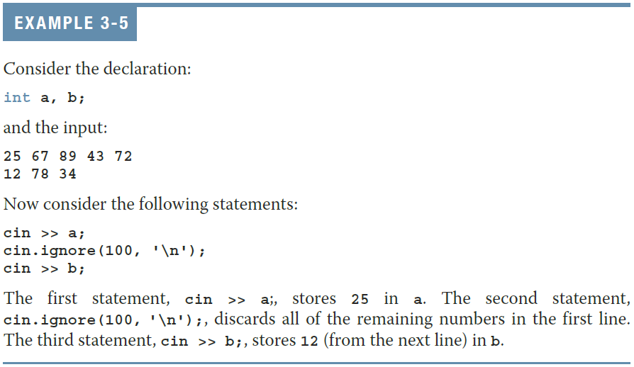
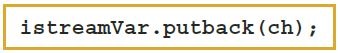
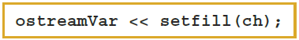

## Objectives{.allowframebreaks}

- In this chapter, you will:
    - Learn what a stream is and examine input and output streams
    - Explore how to read data from the standard input device
    - Learn how to use predefined functions in a program
    - Explore how to use the input stream functions `get`, `ignore`, `putback`, and `peek`
    - Become familiar with input failure
    - Learn how to write data to the standard output device
    - Discover how to use manipulators in a program to format output
    - Learn how to perform input and output operations with the `string` data type
    - Learn how to debug logic errors
    - Become familiar with file input and output

## I/O Streams and Standard I/O Devices I

- I/O: sequence of bytes (stream of bytes) from source to destination
    - Bytes are usually characters, unless program requires other types of information
    - **Stream**: sequence of characters from the source to the destination
    - **Input stream**: sequence of characters from an input device to the computer
    - **Output stream**: sequence of characters from the computer to an output device

## I/O Streams and Standard I/O Devices II

- Use **`iostream`** header file to receive data from keyboard and send output to the screen
    - Contains definitions of two data types:
        - `istream`: input stream 
        - `ostream`: output stream
    - Has two variables:
        - `cin`: stands for character input
        - `cout`: stands for character output

## I/O Streams and Standard I/O Devices III

- Variable declaration is similar to:

    ```cpp
    istream cin;
    ostream cout;
    ```

- To use `cin` and `cout`, the preprocessor directive `#include <iostream>` must be used
- **Input stream variables**: type `istream`
- **Output stream variables**: type `ostream`

## `cin` and the Extraction Operator `>>` I

- The syntax of an input statement using `cin` and the extraction operator `>>` is

    {height="50px"}

- The extraction operator `>>` is binary
    - Left-side operand is an input stream variable
        - Example: `cin`
    - Right-side operand is a variable

## `cin` and the Extraction Operator `>>` II

- No difference between a single `cin` with multiple variables and multiple `cin` statements with one variable in each statement

    ```cpp
    cin >> pay_rate >> hours_worked;
    
    cin >> pay_rate; 
    cin >> hours_worked;
    ```

- When scanning, `>>` skips all leading whitespace
    - Blanks and certain nonprintable characters
- `>>` distinguishes between character `'2'` and number `2` by the right-side operand of `>>`
    - If type `char` or `int` (or `double`), the 2 is treated as a character or as a number 2, respectively

## `cin` and the Extraction Operator `>>` III

**TABLE 3-1 Valid Input for a Variable of the Simple Data Type**

| Data Type of `a` | Valid Input for `a` |
| --------- | ------------------------------- |
| `char`    | One printable character except the blank. |
| `int`     | An integer, possibly preceded by a + or - sign. |
| `double`  | A decimal number, possibly preceded by a + or - sign. If the actual data input is an integer, the input is converted to a decimal number with the zero decimal part. |

- Entering a `char` value into an `int` or `double` variable causes serious errors, called **input failure**

## `cin` and the Extraction Operator `>>` IV

- When reading data into a `char` variable
- `>>` skips leading whitespace, finds and stores only the next character
    - Reading stops after a single character
- To read data into an `int` or `double` variable
    - `>>` skips leading whitespace, reads + or - sign (if any), reads the digits (including decimal for floating-point variables)
    - Reading stops on whitespace or a non-digit character

## `cin` and the Extraction Operator `>>` V{.shrink}


## `cin` and the Extraction Operator `>>` VI{.shrink}


## `cin` and the Extraction Operator `>>` VII{.shrink}


## Using Predefined Functions in a Program{.allowframebreaks}

- A function (subprogram) is a set of instructions
    - When activated, it accomplishes a task
- `main` executes when a program is run
- Other functions execute only when called
- C++ includes a wealth of functions
- **Predefined functions** are organized in a collection of libraries called header files
- Header file may contain several functions
- To use a predefined function, you need the name of the appropriate header file
    - You also need to know:
    - Function name
    - Number of parameters required
    - Type of each parameter
    - What the function is going to do
- To use `pow(power)`, include `cmath`
    - Two numeric parameters
    - Syntax: $\textrm{pow(x, y) = }x^{y}$
        - `x` and `y` are the arguments or parameters
- In `pow(2, 3)`, the parameters are `2` and `3`

## `cin` and the `get` Function

- The `get` function
    - Inputs next character (including whitespace)
    - Stores in memory location indicated by its argument
- The syntax of `cin` and the `get` function

    {height="50px"}

    - `varChar` is a `char` variable
        - It is the **argument** (or **parameter**) of the function
- Example

    ```cpp
    char ch;
    cin.get(ch);
    ```

## `cin` and the `ignore` Function I

- `ignore` function
    - Discards a portion of the input
- The syntax to use the function ignore is:

    {height="50px"}
    
    - `intExp` is an integer expression
    - `chExp` is a char expression
- If `intExp` is a value `m`, the statement says to ignore the next `m` characters or all characters until the character specified by `chExp`

## `cin` and the `ignore` Function II{.shrink}



## The `putback` and `peek` Functions I

- `putback` function
    - Places previous character extracted by the `get` function from an input stream back to that stream
- `peek` function
    - Returns next character from the input stream
    - Does not remove the character from that stream

## The `putback` and `peek` Functions II

- Syntax for `putback`

    {height="50px"}

    - `istreamVar`: an input stream variable (such as `cin`)
    - `ch` is a `char` variable
    
- Example

    ```cpp
    char ch;
    cin.get(ch);
    cin.putback(ch);
    ```    

## The `putback` and `peek` Functions III

- Syntax for `peek`

    {height="50px"}

    - `istreamVar`: an input stream variable (such as `cin`)
    - `ch` is a `char` variable

- Example

    ```cpp
    char ch1;
    char ch2 = cin.peek();
    cin.get(ch1);
    cout << "Peeked: " << ch2 << " got: " << ch1 << '\n';
    ```

## The Dot Notation between I/O Stream Variables and I/O Functions: A Precaution

- In the statement

    ```cpp
    cin.get(ch);
    ```
    
    `cin` and `get` are two separate identifiers separated by a dot (`.`)
    
- Called the **dot notation**, the dot separates the input stream variable name from the member, or function, name
- In C++, the dot is the **member access operator**

## Input Failure

- Things can go wrong during execution
- If input data does not match corresponding variables, the program may run into problems
- Trying to read a letter into an `int` or `double` variable will result in an **input failure**
- If an error occurs when reading data
    - Input stream enters the **fail state**

## The `clear` Function I

- Once in a fail state, all further I/O statements using that stream are ignored
- The program continues to execute with whatever values are stored in variables
- This causes incorrect results
- The `clear` function restores the input stream to a working state by clearing an error state flag
    - but it does not remove whatever caused the fail state from the stream itself

## The `clear` Function II
    
- The syntax of the function clear is:

    {height="50px"}

- Example:

    ```cpp
    cin.clear();
    ```

## Output and Formatting Output

- Syntax of `cout` when used with `<<`

    

- **expression** is evaluated
- expression **value** is printed
- **manipulator** is used to format the output
    - Example: 

        ```cpp
        cout << endl;
        ```

## `setprecision` Manipulator I

- Syntax

  {height="50px"}
  
- Outputs decimal numbers with up to n decimal places
- Must include the header file `iomanip`
    
    ```cpp
    #include <iomanip>
    ```

## `setprecision` Manipulator II

- Example

    ```cpp
    double dollars = 24.51;
    // both outputs display 24.51
    cout << dollars << '\n';
    cout << setprecision(5) << dollars << '\n';
    
    ```
    
    | Number | Manipulator | Value Displayed |
    | - | - | - |
    | `28.92786` | `setprecision(3)` | `28.9`  |
    | `21`       | `setprecision(5)` | `21`    |
    | `109.5`    | `setprecision(4)` | `109.5` |
    | `24.38596` | `setprecision(2)` | `24`    |
    
## `fixed` Manipulator I

- `fixed` outputs floating-point numbers in a fixed decimal format
    - Example: `cout << fixed;`
    - Disable by using the stream member function `unsetf`
        - Example: 

            ```cpp
            cout.unsetf(ios::fixed);
            ```
    
- `scientific` manipulator outputs floating-point numbers in scientific format

## `fixed` Manipulator II{.shrink}

- When the `fixed` and `setprecision` manipulators are used together, the value specified by the `setprecision` manipulator will be the number of digits to appear after the decimal point, not the number of significant digits.

- When the `setprecision` manipulator is used alone, the value specified by the `setprecision` manipulator will be the number of significant digits.

## `showpoint` Manipulator

- `showpoint` forces output to show the decimal point and trailing zeros
    - by default, floating-point numbers are not displayed with trailing zeroes, and floating-point numbers that do not have a fractional part are not displayed with a decimal point
- Examples

    ```cpp
    cout << showpoint;
    cout << fixed << showpoint;
    ```

## C++14 Digit Separator

- Reading and writing of long numbers can be error prone
- In C++, commas cannot be used to separate the digits of a number
- C++14 introduces digit separator ' (single-quote character)
    - Example: `87523872918` can be represented as `87'523'872'918`

## `setw`

- Outputs the value of an expression in a specified number of columns

    ```cpp
    int value = 23;
    // displays (   23)
    cout << "(" << setw(5) << value << ")";
    ```

- If number of columns exceeds the number of columns required by the expression
    - Output of the expression is right-justified
    - Unused columns to the left are filled with spaces
- Must include the header file `iomanip`

## Additional Output Formatting Tools

- Additional formatting tools that give you more control over your output:
    - `setfill` manipulator
    - `left` and `right` manipulators
    - `unsetf` manipulator

## `setfill` Manipulator I

- Output stream variables can use `setfill` to fill unused columns with a character

    {height="50px"}

## `setfill` Manipulator II

- Example:

    ```cpp
    double x = 146.789;
    double y = 24.2;
    double z = 1.783; 
    
    cout << setw(10) << x << '\n';
    cout << setw(10) << y << '\n';
    cout << setw(10) << z << '\n';
    ```
    
    Output:
    
    ```
       146.789
          24.2
         1.783
    ```

## `left` and `right` Manipulators I

- `left` manipulator left-justifies the output

    {height="50px"}

- Disable `left` by using unsetf

    {height="50px"}

- `right` manipulator right-justifies the output

    {height="50px"}

## `left` and `right` Manipulators II

- Example

    ```cpp
    double x = 146.789;
    double y = 24.2;
    double z = 1.783; 
    
    cout << setw(10) << x << '\n';
    cout << left << setw(10) << y << '\n';
    cout << right << setw(10) << z << '\n';
    ```
    
    Output:
    
    ```
       146.789
    24.2
         1.783
    ```

## Types of Manipulators

- Two types of manipulators
    - Those with parameters
    - Those without parameters
- **Parameterized stream manipulators** require the `iomanip` header
    - `setprecision`, `setw`, and `setfill`
- Manipulators without parameters require the `iostream` header
    - `endl`, `fixed`, `scientific`, `showpoint`, `left`, `right`

## Input/Output and the `string` Type

- An input stream variable (such as `cin`) and `>>` operator can read a string into a variable of the data type `string`
- The extraction operator:
    - Skips any leading whitespace characters
    - Stops reading at a whitespace character
- The function `getline` reads until end of the current line

    {height="50px"}

## Debugging: Understanding Logic Errors and Debugging with `cout` statements

- Syntax errors are reported by the compiler
- Logic errors are typically not caught by the compiler
    - Spot and correct using `cout` statements
        - Temporarily insert an output statement
    - Correct the problem
    - Remove output statement

## File Input/Output I

- A file is an area in secondary storage to hold info
- File I/O is a five-step process
    1. Include `fstream` header
    2. Declare file stream variables
    3. Associate the file stream variables with the input/output sources – referred to as **opening the files**
    4. Use the file stream variables with >>, <<, or other input/output functions 
    5. Close the files

## File Input/Output II{.shrink}
 - Example
 
```cpp
#include <fstream>                            // 1. include fstream header
using namespace std;

int main() {
    ifstream infile;                          // 2. declare stream variables
    ofstream outfile;
    int      value;
    double   cost;

    infile.open("input.txt");                 // 3. open files
    outfile.open("output.txt");

    infile >> value >> cost;                  // 4. read from input file

    cost *= value;

    outfile << value << ':' << cost << '\n';  // 4. write to output file

    infile.close();                           // 5. close the files
    outfile.close();

    return 0;
}
```

## Quick Review{.allowframebreaks}

- Stream: infinite sequence of characters from a source to a destination
    - Input stream: from a source to a computer
    - Output stream: from a computer to a destination


- To use `cin` and `cout`, include `iostream` header
    - `cin`: character input
    - `cout`: character output
- `get` reads data character-by-character
- `ignore` skips data in a line
- `putback` puts last character retrieved by get back to the input stream
- `peek` returns next character from input stream, but does not remove it
- Attempting to read invalid data into a variable causes the input stream to enter the fail state
- The manipulators `setprecision`, `fixed`, `showpoint`, `setw`, `setfill`, `left`, and `right` can be used for formatting output
- Include `iomanip` for manipulators with parameters, e.g. `setprecision`, `setw`, and `setfill`
- Header `fstream` contains the definitions of `ifstream` and `ofstream`

## Questions?

<!--EOF-->
