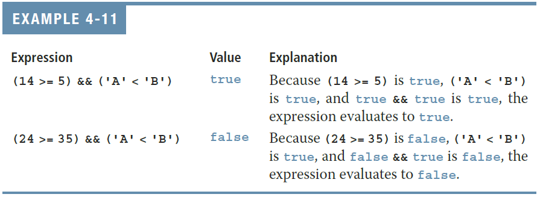
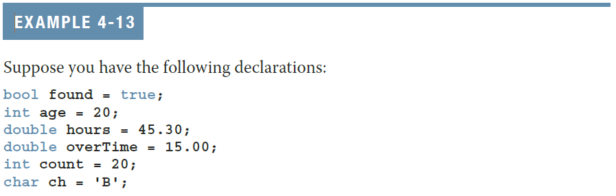

## Objectives{.allowframebreaks}

- In this chapter, you will:
    - Learn about control structures
    - Examine relational operators
    - Discover how to use the selection control structures `if`, `if...else`
    - Examine `int` and `bool` data types and logical (Boolean) expressions
    - Examine logical operators
    - Explore how to form and evaluate logical (Boolean) expressions
    - Learn how relational operators work with the `string` type
    - Become aware of short-circuit evaluation
    - Learn how the conditional operator, `?:`, works
    - Learn how to use pseudocode to develop, test, and debug a program
    - Discover how to use a `switch` statement in a program
    - Learn how to avoid bugs by avoiding partially understood concepts
    - Learn how to use the `assert` function to terminate a program

## Control Structures{.allowframebreaks}

- A computer can proceed:
    - In sequence
    - Selectively (branch): making a choice
    - Repetitively: looping
    - By calling a function
- The two most common control structures are:
    - Selection
    - Repetition


## Selection: `if` and `if...else`

- An expression that evaluates to `true` or `false` is called a logical expression
    - "8 is greater than 3" is `true`

## Relational Operators

**TABLE 4-1 Relational Operators in C++**

| Operator | Description              |
| :------: | ------------------------ |
| `==`     | equal to                 |
| `!=`     | not equal to             |
| `<`      | less than                |
| `<=`     | less than or equal to    |
| `>`      | greater than             |
| `>=`     | greater than or equal to |

- Each relational operator is a binary operator (requires two operands)
- Expressions using these operators always evaluate to `true` or `false`

## Relational Operators and Simple Data Types

- You can use the relational operators with all three simple data types

    

## Comparing Characters

- In an expression of `char` values using relational operators:
    - The result depends on the machine's collating sequence
        - ASCII character set
- Logical (Boolean) expressions:
    - Include expressions such as `4 < 6` and `'R' > 'T'`
    - Returns the `bool` value `true` if the logical expression evaluates to true
    - Returns the `bool` value `false` otherwise

## ASCII Character Set (in decimal){.shrink}


## One-Way Selection{.allowframebreaks}

- One-way selection syntax

    ```cpp
    if (expression) 
    {
        statement
    }
    ```

- The statement is:
    - Executed if the value of the expression is `true`
    - Bypassed if the value is `false`; program goes to the next statement
- The **expression** is also called a **decision maker**
- The statement following the expression is also called the **action statement**


## Two-Way Selection{.allowframebreaks}

- Two-way selection syntax

    ```cpp
    if (expression)
    {
        statement1
    }
    else
    {
        statement2
    }
    ```
 
- If **expression** is `true`, **statement1** is executed; otherwise, **statement2** is executed
    - **statement1** and **statement2** are any C++ statements


## `int` Data Type and Logical (Boolean) Expressions

- Earlier versions of C++ did not provide built-in data types that had Boolean values
    - Logical expressions evaluated to either `1` or `0`
    - Logical expression value was stored in a variable of the data type `int`
- Modern C++ uses the `bool` data type

## `bool` Data Type and Logical (Boolean) Expressions

- The data type `bool` has logical (Boolean) values `true` and `false`
- `bool`, `true`, and `false` are reserved words
- The identifier `true` is promoted to the integer value 1
- The identifier `false` is promoted to the integer value 0

## Logical (Boolean) Operators and Logical Expressions I

- **Logical (Boolean) operators** enable you to combine logical expressions

**TABLE 4-2 Logical (Boolean) Operators in C++**

| Operator | Description    |
| :------: | :------------: |
| `!`      | not            |
| `&&`     | and            |
| `||`     | or             | <!--Displays properly in beamer.-->

## Logical (Boolean) Operators and Logical Expressions II

**TABLE 4-3 The `!` (Not) Operator**

| Expression | !(Expression) |
| :--------: | :-----------: |
| `false`    | `true`        |
| `true`     | `false`       |


## Logical (Boolean) Operators and Logical Expressions III

**TABLE 4-4 The `&&` (And) Operator**

| Expression1 | Expression2 | Expression1 && Expression2 |
| :---------: | :---------: | :------------------------: |
| `false` | `false` | `false` |
| `false` | `true`  | `false` |
| `true`  | `false` | `false` |
| `true`  | `true`  | `true`  |

## Logical (Boolean) Operators and Logical Expressions IV



## Logical (Boolean) Operators and Logical Expressions V

**TABLE 4-5 The `||` (Or) Operator**

| Expression1 | Expression2 | Expression1 \|\| Expression2 |
| :---------: | :---------: | :--------------------------: |
| `false`     | `false`     | `false`                      |
| `false`     | `true`      | `true`                       |
| `true`      | `false`     | `true`                       |
| `true`      | `true`      | `true`                       |

## Logical (Boolean) Operators and Logical Expressions VI


## Order of Precedence I

- Relational and logical operators are evaluated from left to right
    - The **associativity** is left to right
- Parentheses can override precedence

## Order of Precedence II

**TABLE 4-6 Precedence of Operators**

| Operators | Precedence                    |
| :-------- | ----------------------------- |
| `!`, `+`, `-` (unary operators) | first   |
| `*`, `/`, `%`                   | second  |
| `+`, `-`                        | third   |
| `<`, `<=`, `>=`, `>`            | fourth  |
| `==`, `!=`                      | fifth   |
| `&&`                            | sixth   |
| `||`                            | seventh | <!--Works for beamer-->
| `=` (assignment operator)       | last    |

## Order of Precedence III



## Order of Precedence IV{.shrink}


## Order of Precedence V{.shrink}


## Relational Operations and the `string` Type I

- Relational operators can be applied to variables of type `string`
    - Strings are compared character by character, starting with the first character
    - Comparison continues until either a mismatch is found or all characters are found equal
    - If two strings of different lengths are compared and the comparison is equal to the last character of the shorter string
        - The shorter string is less than the larger string

## Relational Operations and the `string` Type II

- Suppose we have the following declarations:

    ```cpp
    string str1 = "Hello";
    string str2 = "Hi";
    string str3 = "Air";
    string str4 = "Bill";
    string str4 = "Big";
    ```

## Relational Operations and the `string` Type III{.shrink}


## Relational Operations and the `string` Type IV{.shrink}


## Relational Operations and the `string` Type V{.shrink}


## Compound (Block of) Statements I

- A **compound statement** (**block of statements**) has this form:

    {height="150px"}

- A compound statement functions like a single statement

- CSN Coding Standard: always use compound statements with `if` and `else`.

## Compound (Block of) Statements II

```cpp
if (age > 18) { 
    cout << "Eligible to vote.\n"; 
    cout << "No longer a minor.\n";
} 
else { 
    cout << "Not eligible to vote.\n"; 
    cout << "Still a minor.\n"; 
}
```

## Multiple Selections: Nested `if` I

- When one control statement is located within another, it is said to be **nested**
- An `else` is associated with the most recent `if` that has not been paired with an else
- Avoids the "dangling else"

    ```cpp
    if (condition)
        if (condition)
             if (condition)
    else
        cout << "dangling else!\n";
    ```

## Multiple Selections: Nested `if` II

```cpp
if (score >= 90) {
    cout << "The grade is A.";
} else if (score >= 80) {
    cout << "The grade is B.";
} else if (score >= 70) {
    cout << "The grade is C.";
} else if (score >= 60) {
    cout << "The grade is D.";
} else {
    cout << "The grade is F.";
}
```

## Comparing `if...else` Statements with a Series of `if` Statements I

```cpp
if (month == 1) {
    cout << "January";
} else if (month == 2) {
    cout << "February";
} else if (month == 3) {
    cout << "March";
.
.
} else if (month == 12) {
    cout << "December";
}
```

## Comparing `if...else` Statements with a Series of `if` Statements II

```cpp
if (month == 1) {
    cout << "January";
}
if (month == 2) {
    cout << "February";
}
if (month == 3) {
    cout << "March";
}
.
.
} if (month == 12) {
    cout << "December";
}
```

## Short-Circuit Evaluation

- **Short-circuit evaluation**: evaluation of a logical expression stops as soon as the value of the expression is known

    

## Comparing Floating-Point Numbers for Equality: A Precaution

- Comparison of floating-point numbers for equality may not behave as you would expect
    - Example:
        `1.0 == 3.0/7.0 + 2.0/7.0 + 2.0/7.0` evaluates to `false`

        Why? `3.0/7.0 + 2.0/7.0 + 2.0/7.0 = 0.99999999999999989`
        
    - Example:
        `1.0/10.0 == 0.10000000000000001` evaluates to `true`
        
        Why? Internal representation of 0.1 is the same as 0.10000000000000001. `0.1000000000000000055511151231257827021181583404541015625 == 0.1`, too!

- A solution is checking for a tolerance value (the *epsilon*)
    - Example: 

        ```cpp
        const double EPSILON = 0.000001;  // acceptable tolerance
        if (fabs(x – y) < EPSILON) { ...
        ```

## Associativity of Relational Operators: A Precaution I

```cpp
int num;
cout << "Enter an integer: "; 
cin >> num; 
    
if (0 <= num <= 10) { 
    cout << num << " is within 0 and 10.\n";
} else { 
    cout << num << " is not within 0 and 10.\n";
} 
```

## Associativity of Relational Operators: A Precaution II

- `num == 5` 

    | = `0 <= 5 <= 10` | Analysis |
    | ------------------ | ---------------------------------------- |
    | = `(0 <= 5) <= 10` | Because relational operators are evaluated from left to right |
    | = `1 <= 10` | Because `0 <= 5` is `true`, `0 <= 5` evaluates to `true`, which is promoted to the `int` value `1` in a mixed expression |
    | = `true` (1) |  |

## Associativity of Relational Operators: A Precaution III

- `num == 20`

    | = `0 <= 20 <= 10` | Analysis |
    | ------------------ | ---------------------------------------- |
    | = `(0 <= 20) <= 10` | Because relational operators are evaluated from left to right |
    | = `1 <= 10` | Because `0 <= 20` is true, `0 <= 20` evaluates to `true`, which is promoted to the `int` value `1` in a mixed expression
    = `true` (1) |  |

<!--## Avoiding Bugs by Avoiding Partially Understood Concepts and Techniques

- Must use concepts and techniques correctly
    - Otherwise solution will be either incorrect or deficient
- If you do not understand a concept or technique completely
    - Do not use it
    - Save yourself an enormous amount of debugging time-->

## Input Failure and the `if` Statement I{.shrink}

- If an input stream enters a fail state:
    - All subsequent input statements associated with that stream are ignored
    - Program continues to execute
    - The code may produce erroneous results

## Input Failure and the `if` Statement II {.shrink}

- Use `if` statements to check status of input stream
- If the input stream enters the fail state, include  instructions that stop program execution

    ```cpp
    int exit_status = 0;
    int value;
    
    cin >> value;
    
    if (!cin) {
        cout << "Input failure. Try again.\n";
        exit_status = 1;
    } else { 
        // process the input 
    }
    
    return exit_status;
    ```

## Input Failure and the `if` Statement III {.shrink}

- Several ways of testing for stream failure:

    ```cpp
    if (!cin)        { ...
    if (cin.fail())  { ...
    if (!cin.good()) { ...
    ```

## Confusion Between the Equality (`==`) and Assignment (`=`) Operators

- C++ allows you to use any expression that can be evaluated to either `true` or `false` as an expression in the `if` statement 

    ```cpp
    if (x = 5) {
        cout << "The value is five.\n";
    }
    ```

- The appearance of `=` in place of `==` resembles a silent killer
    - It is not a syntax error
        - It is a logical error

## Conditional Operator (`?:`)

- **Conditional operator** (`?:`)
- Ternary operator: takes three arguments
- Syntax for the conditional operator

    {width="400px"}

- If **expression1** is `true`, the result of the **conditional expression** is **expression2**
    - Otherwise, the result is **expression3**
- Example: `max = (a >= b) ? a : b;`

## Program Style and Form (Revisited): Indentation

- A properly indented program:
    - Helps you spot and fix errors quickly
    - Shows the natural grouping of statements
- Insert a blank line between statements that are naturally separate
- Two commonly used styles for placing braces
    - On a line by themselves (easier for beginners to match braces)
    - Or left brace is placed after the expression, and the right brace is on a line by itself (saves vertical space)

## Using Pseudocode to Develop, Test, and Debug a Program

- **Pseudocode** is an informal mixture of C++ and ordinary language
    - Helps you quickly develop the correct structure of the program and avoid making common errors
- Use a wide range of values in a walk-through to evaluate the program

## `switch` Structures I

- **switch structure** is an alternate to `if...else`
- `switch` (integral) expression is evaluated first
- Value of the expression determines which corresponding action is taken
- Expression is sometimes called the **selector**

## `switch` Structures II{.shrink}

```cpp
switch (expression) {
    case value1:
        statements
        break;
    case value2:
        statements
        break;
        .
        .
    case valuen:
        statements
        break;
    default:
        statements
        break;  // the default case also has a break
}
```

## `switch` Structures III{.shrink}


## `switch` Structures IV

- One or more statements may follow a `case` label
- Braces are not needed to turn multiple statements into a single compound statement
- When a `case` value is matched, all statements after it execute until a `break` is encountered
- The `break` statement may or may not appear after each statement
- Switches should (almost always) have a `default` case. The `default` case should also have a `break` statement.
- `switch`, `case`, `break`, and `default` are reserved words

## `switch` Structures V{.shrink}

- Consider the following statement in which `grade` is a variable of type `char`

    ```cpp
    char grade;
    switch (grade) {
        case 'A':  cout << "The grade point is 4.0";  break;
        case 'B':  cout << "The grade point is 3.0";  break;
        case 'C':  cout << "The grade point is 2.0";  break;
        case 'D':  cout << "The grade point is 1.0";  break;
        default:   cout << "The grade point is 0.0";  break;
    }
    ```

## `switch` Structures VI{.shrink}

```cpp
int score;
switch (score / 10) {
    case 10:
    case  9:   cout << "The grade point is 4.0";  break;
    case  8:   cout << "The grade point is 3.0";  break;
    case  7:   cout << "The grade point is 2.0";  break;
    case  6:   cout << "The grade point is 1.0";  break;
    default:   cout << "The grade point is 0.0";  break;
}
```

## `switch` Structures VII{.shrink}

- Intentional fall-through case allows you to execute the same code for multiple cases without repeating it, enhancing code readability and reducing the chances of introducing errors.

    ```cpp   
    switch (day) {
        case 1:
        case 2:
        case 3:
        case 4:
        case 5:
            cout << "Weekday\n";
            break;
        case 6:
        case 7:
            cout << "Weekend\n";
            break;
        default:
            cout << "Invalid day\n";
            break;
    }
    ```

## Avoiding Bugs: Revisited

- Consider whether the `switch` structure must include a `break` statement after each `cout` statement

## Terminating a Program with the `assert` Function

- Certain types of errors are very difficult to catch
    - Example: division by zero
- The `assert` function (macro) is useful in stopping program execution when certain elusive errors occur

## The assert Function{.allowframebreaks}

- Syntax

    {height="50px"}

    - **expression** is any logical expression
- If **expression** evaluates to `true`, the next statement executes
- If **expression** evaluates to `false`, the program terminates and indicates where in the program the error occurred
- To use `assert`, include `cassert` header file
- `assert` is useful for enforcing programming constraints during program development
- After developing and testing a program, remove or disable `assert` statements
- The preprocessor directive `#define NDEBUG` must be placed *before* the directive `#include <cassert>` to disable the `assert` statement

## Quick Review{.allowframebreaks}

- Control structures alter normal control flow
- Most common control structures are selection and repetition
- Relational operators: `==`, `<`, `<=`, `>`, `>=`, `!=`
- Logical expressions evaluate `true` or `false`
- Logical operators: `!` (not), `&&` (and), `||` (or)
- Two selection structures are one-way selection and two-way selection
- The expression in an `if` or `if...else` structure is usually a logical expression
- No stand-alone `else` statement exists in C++
    - Every `else` has a related `if`
- A sequence of statements enclosed between braces, `{` and `}`, is called a compound statement or a block of statements
- Using assignment (`=`) in place of the equality operator (`==`) creates a semantic error
- The execution of a `switch` structure handles multiway selection
- The execution of a `break` statement ends a `switch` statement
- Use `assert` to terminate a program if certain conditions are not met

## General Programming Guidelines

- `if..else` statements must always use compound statements.

## Questions?

<!--EOF-->

