## Objectives (1 of 2){.shrink}

- In this chapter, you will:
    - Learn about repetition (looping) control structures
    - Learn how to use a **while** loop in a program
    - Explore how to construct and use counter-controlled, sentinel-controlled, flag-controlled, and EOF-controlled repetition structures
    - Learn how to use a **for** loop in a program
    - Learn how to use a **do...while** loop in a program

## Objectives (2 of 2){.shrink}

- Examine **break** and **continue** statements
- Discover how to form and use nested control structures
- Learn how to avoid bugs by avoiding patches
- Learn how to debug loops

## Why Is Repetition Needed?{.shrink}

- Repetition allows efficient use of variables
- It is possible to input, add, and average multiple numbers using a limited number of variables
- Consider the code to determine the average number of calories burned each day doing regular exercise
    - Method 1: Declare a variable for each day and enter the number of calories burned, add the values and store in a variable for the week’s total, and divide the total by 7 to find the average
    - Method 2: Create a loop that reads a number into a variable and adds it to a variable that contains the sum of the numbers  (only two variables needed)

## Looping (Repetition) Structure (1 of 3){.shrink}

- A **while** loop is one of three repetition, or looping structures in C++
- Syntax of the while statement

    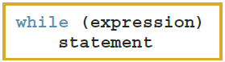{height="75px"}

- The **statement** can be simple or compound
- The **expression** acts as a decision maker and is usually a logical expression
- The **statement** is called the body of the loop
- The parentheses are part of the syntax

## Looping (Repetition) Structure (2 of 3){.shrink}

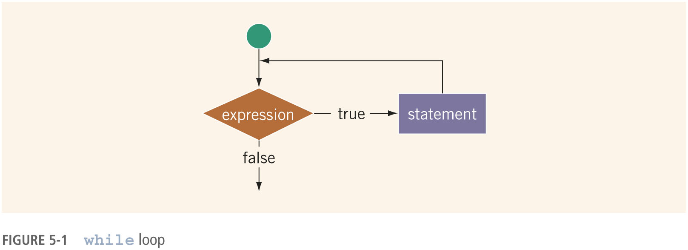

- The **expression** provides an entry condition to the loop
- The **statement** (body of the loop) continues to execute until the expression is no longer `true`
- An infinite loop continues to execute endlessly

## Looping (Repetition) Structure (3 of 3){.shrink}

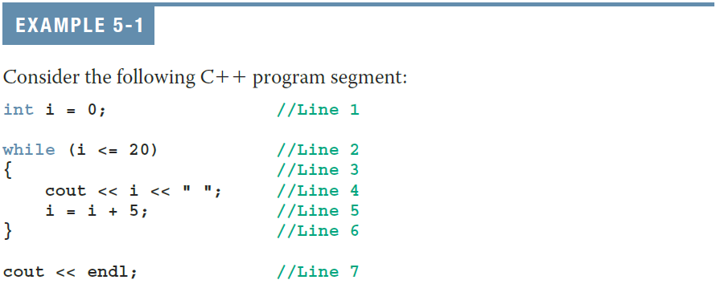

- The preceding **while** loop produces the following output:

    ```
    0 5 10 15 20
    ```

- The variable `i` in Example 5-1 is called the **loop control variable** (LCV)

## Looping (Repetition) Structure (cont’d.){.shrink}

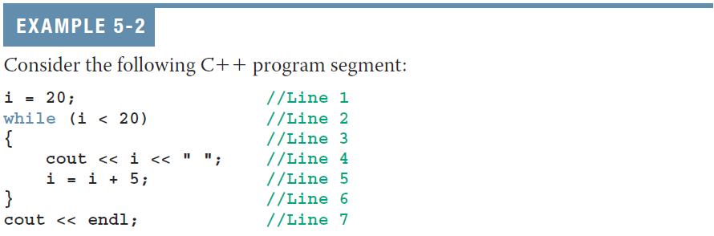

## Case 1: Counter-Controlled while Loops{.shrink}

- When you know exactly how many times the statements need to be executed 
    - Use a **counter-controlled while loop**

    ```cpp
    counter = 0;          // initialize LCV 
    while  (counter < N)  // test LCV
    {   
        ...    
        counter++;        // update LCV
    }
    ```

## Case 2: Sentinel-Controlled while Loops{.shrink}

- A **sentinel** variable is tested in the condition
- The loop ends when the sentinel is encountered
- The following is an example of a **sentinel-controlled while loop**:

    ```cpp
    cin >> variable;              // initialize LCV
    while (variable != sentinel)  // test LCV
    {   
        ... 
        cin >> variable;          // update LCV
    }
    ```

<!--## Example 5-5: Telephone Digits

- Example 5-5 provides an example of a sentinel-controlled loop
- The program converts uppercase letters to their corresponding telephone digit
- The sentinel value is **#** -->

## Case 3: Flag-Controlled while Loops{.shrink}

- **Flag-controlled while loop**: uses a `bool` variable to control the loop

    ```cpp
    isFound = false;         // initialize LCV 
    while (!isFound)         // test LCV
    {   
        ... 
        if (expression) { 
            isFound = true;  // update LCV
        }
    }
    ```

## Number Guessing Game (1 of 2)

- Example 5-6 implements a number guessing game using a flag-controlled while loop
- Uses the function `rand` of the header file cstdlib to generate a random number
- `rand()` returns an int value between 0 and 2147483647
- To convert to an integer >= 1 and <= 100: 
    - `rand() % 100 + 1`

## Number Guessing Game (2 of 2){.shrink}

```cpp
const int secret = rand() % 100 + 1;
int  guess;
int  attempts = 0;
bool done     = false;

srand(static_cast<unsigned int>(time(nullptr)));

cout << "Try to guess the secret number between 1 and 100.\n";

while (!done) {
    cout << "Enter your guess: ";
    cin >> guess;
    ++attempts;

    if (guess < secret) {
        cout << "Too low! Try again.\n";
    } else if (guess > secret) {
        cout << "Too high! Try again.\n";
    } else {
        cout << "Congratulations! You guessed the secret number (" 
             << secret << ") in " << attempts << " attempts!\n";
        done = true;  // exit loop
    }
}
```

## Case 4: EOF-Controlled while Loops (1 of 2){.shrink}

- An **end-of-file (EOF)-controlled while loop** is a good choice when it is difficult to select a sentinel value
- The logical value returned by `cin` can determine if there is no more input

## Case 4: EOF-Controlled while Loops (2 of 2){.shrink}

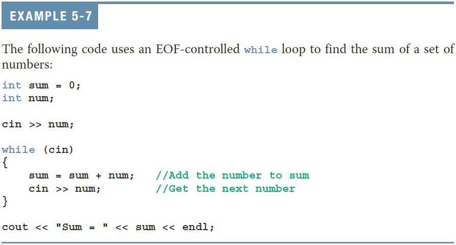

## Case 4: EOF-Controlled while loops (3 of 3){.shrink}

The following loop is functionally equivalent to the previous code:

```cpp
while (cin >> num) 
{
    sum = sum + num;
}
```

## eof Function{.shrink}

- The function **eof** can determine the end of file status
- **eof** is a member of data type **istream**
- Syntax for the function **eof**

    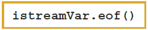{height="50px"}

- **istreamVar** is an input stream variable, such as `cin`
- Example:

    ```cpp
    if (!cin.eof()) { ...
    ```

## fail Function{.shrink}

- The function **fail** can determine if a stream has entered a fail state.
- **fail** is a member of data type **istream**
- Example:

    ```cpp
    while (!cin.fail()) { ...
    ```

## good Function{.shrink}

- The function **good** can determine if a stream is in a good state, i.e., it has not entered a fail state.
- **good** is a member of data type **istream**
- Example:

    ```cpp
    while (cin.good()) { ...
    ```

## More on Expressions in while Statements{.shrink}

- The expression in a while statement can be complex
- Example:

    ```cpp
    while ((noOfGuesses < 5) && (!isGuessed))
    {
        . . .
    }
    ```

## Looping (Repetition) for Statement (1 of 7){.shrink}

- for loop: called a counted or indexed for loop
- Syntax of the for statement

    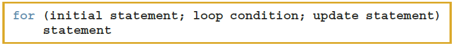

- The **initialstatement**, **loopcondition**, and **updatestatement** are called `for` loop control statements

## Looping (Repetition) for Statement (2 of 7){.shrink}

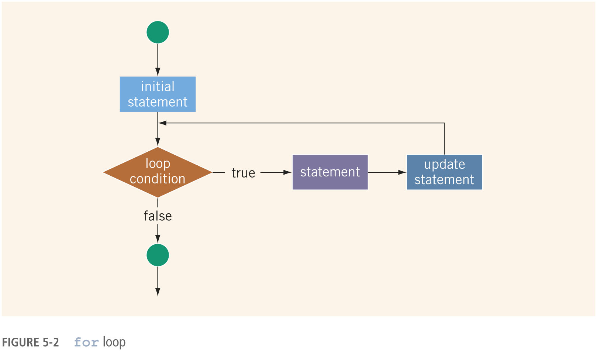

## Looping (Repetition) for Statement (3 of 7){.shrink}

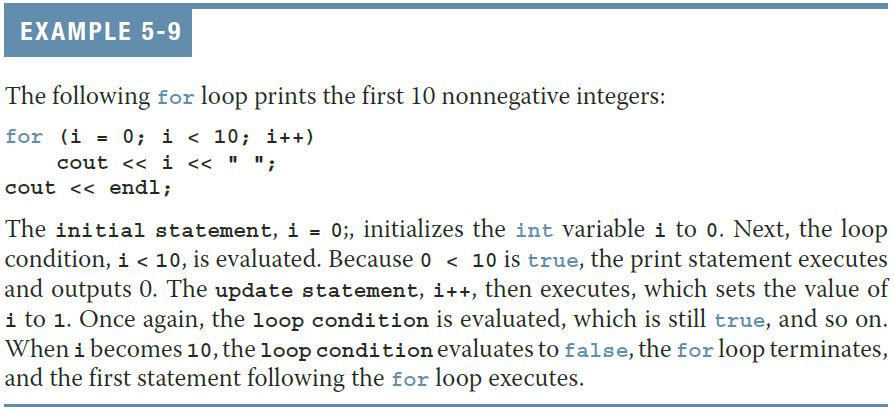

## Looping (Repetition) for Statement (4 of 7){.shrink}

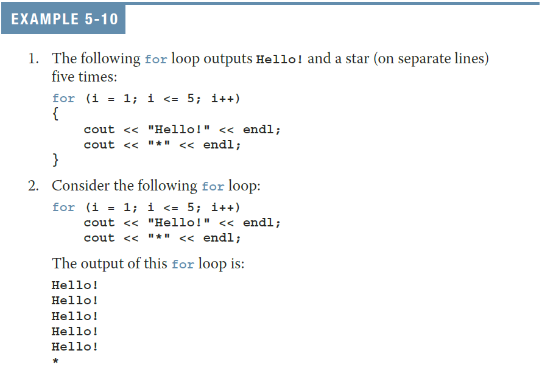

## Looping (Repetition) for Statement (5 of 7){.shrink}

- The following is a semantic error:

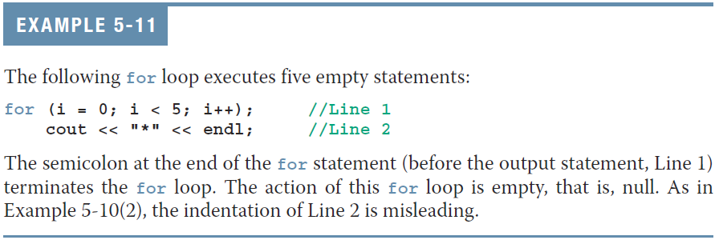

- The following is a legal (but infinite) `for` loop:
 
    ```cpp
    for (;;) {
        cout << "Hello" << endl;
    }
    ```

## Looping (Repetition) for Statement (6 of 7){.shrink}

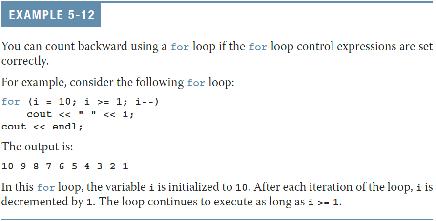

## Looping (Repetition) for Statement (7 of 7){.shrink}
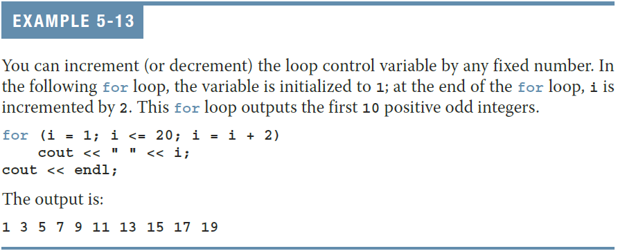

## Looping (Repetition) do..while Statement (1 of 6){.shrink}

- Syntax of a `do...while` loop

    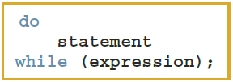{height="100px"}

- The **statement** executes first, and then the **expression** is evaluated
    - As long as **expression** is true, loop continues
- To avoid an infinite loop, body must contain a statement that makes the **expression** `false`

## Looping (Repetition) do..while Statement (2 of 6){.shrink}

- The statement can be simple or compound
    - But our coding standard stipulates it will always be compound.
- Loop always iterates at least once

## Looping (Repetition) do..while Statement (3 of 6){.shrink}


## Looping (Repetition) do..while Statement (4 of 6){.shrink}

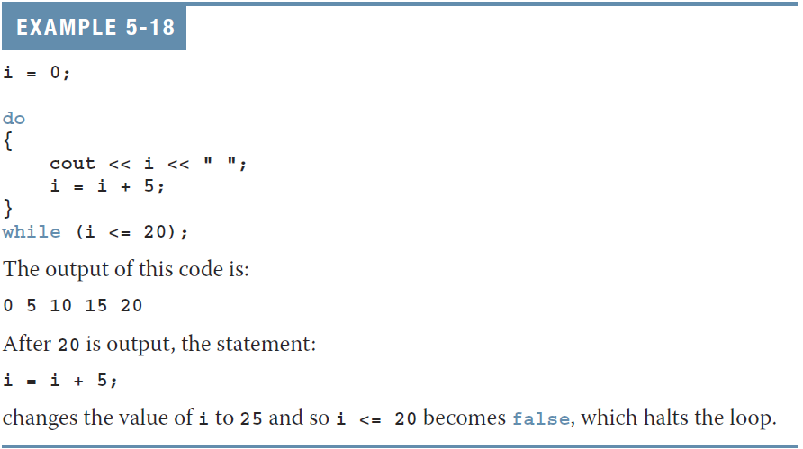

## Looping (Repetition) do..while Statement (5 of 6){.shrink}

- Note that **while** and **for** loops are **pretest loops**
    - It is possible that these loops many never activate due to entry conditions
- In contrast, **do. . .while** loops are **posttest loops**
    - These loops always execute at least once

## Looping (Repetition) do..while Statement (6 of 6){.shrink}

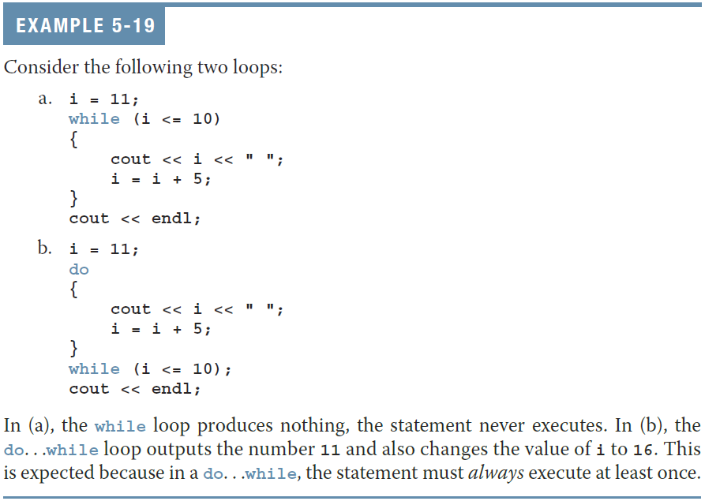}

## Choosing the Right Looping Structure{.shrink}

- All three loops have their place in C++
    - If you can determine in advance the number of repetitions needed, the **for** loop is the correct choice
    - If you do not know and cannot determine in advance the number of repetitions needed, and it could be zero, use a **while** loop
    - If you do not know and cannot determine in advance the number of repetitions needed, and it is at least one, use a **do...while** loop

## break and continue Statements (1 of 2){.shrink}

- **break** and **continue** alter the flow of control
- **break** statement is used for two purposes:
    - To exit early from a loop
    - To skip the remainder of a switch structure
- After **break** executes, the program continues with the first statement after the structure
- A **break** statement in a loop can eliminate the use of certain (flag) variables
- **The use of `break` to alter the flow of control in a repetition structure is never permitted in this course.**

## break and continue Statements (2 of 2){.shrink}

- **continue** is used in **while**, **for**, and **do...while** structures
- When executed in a loop
    - It skips remaining statements and proceeds with the next iteration of the loop
- **The use of `continue` to alter the flow of control in a repetition structure is not permitted in this course.**

## Nested Control Structures (1 of 2){.shrink}

- To create the following pattern:

    ```
    *
    **
    ***
    ****
    *****
    ```

- We can use the following code:

    ```cpp
    for (int i = 1; i <= 5; i++) {      // Line 1
        for (int j = 1; j <= i; j++) {  // Line 2 
            cout << "*";                // Line 3 
        }                               // Line 4
        cout << endl;                   // Line 5 
    }                                   // Line 6
    ```

## Nested Control Structures (2 of 2){.shrink}

- What is the result if we replace the first for statement with this?

    ```cpp
    for (i = 5; i >= 1; i--) {
    ```
    
- Answer:

    ```
    *****
    ****
    ***
    **
    *
    ```

<!--## Avoiding Bugs by Avoiding Patches

- A software patch is a piece of code written on top of an existing piece of code
    - Intended to fix a bug in the original code
- Some programmers address the symptom of the problem by adding a software patch
- A programmer should instead resolve the underlying issue-->

## Debugging Loops{.shrink}

- Loops are harder to debug than sequence and selection structures
- Use a loop invariant
    - Set of statements that remains true each time the loop body is executed
        - Excellent place to use an `assert`
- The most common error associated with loops is **off-by-one**

## Quick Review (1 of 3){.shrink}

- C++ has three looping (repetition) structures:
    - **while**, **for**, and **do...while**
- **while**, **for**, and **do** are reserved words
- **while** and **for** loops are called pretest loops
- **do...while** loop is called a posttest loop
- **while** and **for** may not execute at all, but **do...while** always executes at least once
    - After first iteration, pretest and posttest loops are equivalent.

## Quick Review (2 of 3){.shrink}

- In a while loop:
    - The expression is the decision maker
    - The statement is the body of the loop
- A while loop can be:
    - Counter-controlled
    - Sentinel-controlled
    - EOF-controlled
- In the Windows console environment, the end-of-file marker is entered using **Ctrl+z**
- In the macOS / Linux / UNIX word, the end-of-file maker is entered using **Ctrl-d**

## Quick Review (3 of 3){.shrink}

- A **for** loop simplifies the writing of a counter-controlled while loop
- Putting a semicolon at the end of the for loop is a semantic error
- Executing a **break** statement in the body of a loop immediately terminates the loop
- Executing a **continue** statement in the body of a loop skips to the next iteration

<!--EOF-->

