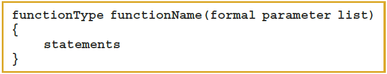
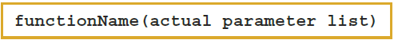
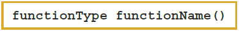
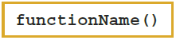
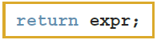
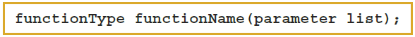
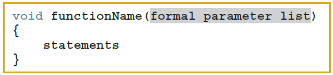
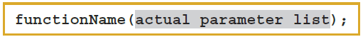
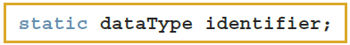

## Objectives

In this chapter, you will:

- Learn about standard (predefined) functions and discover how to use them in a program
- Learn about user-defined functions
- Examine value-returning functions , including actual and formal parameters
- Explore how to construct and use a value-returning, user-defined function in a program
- Learn about function prototypes
- Learn how to construct and use void functions

## Objectives

- Discover the difference between value and reference parameters
- Explore reference parameters and value-returning functions
- Learn about the scope of an identifier
- Examine the difference between local and global identifiers
- Discover static variables
- Learn how to debug programs using drivers and stubs
- Learn function overloading
- Explore functions with default parameters

## Introduction

- Functions allow complicated programs to be divided into manageable pieces
- Functions are often called **modules**
- They are like miniature programs that can be combined to form larger programs

## Predefined Functions (1 of 3)

- In C++, a function is similar to that of a function in algebra
    - It has a name
    - It does some computation
- Some of the predefined mathematical functions are:
    
    ```cpp
    pow(x, y) 
    sqrt(x) 
    floor(x)
    ```

## Predefined Functions (2 of 3)

- Predefined functions are organized into separate libraries
    - I/O functions are in `iostream` header
    - Math functions are in `cmath` header
- To use predefined functions, you must include the header file using an **include** statement

## Predefined Functions (3 of 3){.shrink}

| Function | Header | Purpose |
|---|---|---------|
| `abs(x)`  | `<cmath>`  | Returns absolute value of argument, e.g., `abs(-7) = 7`  |
| `ceil(x)` | `<cmath>` | Returns the smallest whole number that is not less than x, e.g., `ceil(56.34) = 57.0`, `ceil(-56.34) = -56.0` |
| `floor(x)` | `<cmath>` | Returns the largest whole number that is not greater than x, e.g., `floor(45.67) = 45.0`, `floor(-45.67) = -46.0` |
| `islower(x)` | `<cctype>` | Returns non-zero if x is a lowercase character, zero otherwise |
| `isupper(x)` | `<cctype>` | Returns non-zero if x is an uppercase character, zero otherwise |
| `pow(x, y)` | `<cmath>` | Returns $x^{y}$, e.g., `pow(0.16, 0.5) = 0.4` |
| `round(x)` | `<cmath>` | Returns the nearest whole number, rounding halfway away from zero, e.g., `round(42.3) = 42.0`, `round(42.7) = 43.0` |
| `sqrt(x)` | `<cmath>` | Returns the non-negative square root of x, e.g., `sqrt(4.0) = 2.0` |
| `tolower(x)` | `<cctype>` | Returns the lowercase value of x if x is uppercase, otherwise returns x |
| `toupper(x)` | `<cctype>` | Returns the uppercase value of x if x is lowercase, otherwise returns x |

https://en.cppreference.com/w/cpp/header/cctype
https://en.cppreference.com/w/cpp/header/cmath

## User-Defined Functions

- **Value-returning functions** have a return type
    - Return a value of a specific data type using the `return` statement
- **Void functions** do not have a return type
    - *Do not* use a `return` statement to return a value

## Value-Returning Functions (1 of 3)

- To use these functions, you must:
    - Include the appropriate header file in your program using the include statement
    - Know the following items:
        -	Name of the function
        -	Number of parameters, if any
        -	Data type of each parameter
        -	Data type of the value returned, called the type of the function

## Value-Returning Functions (2 of 3)

- Can use the value returned by a value-returning function by:
    - Saving it for further calculation

        ```cpp
        double result = sqrt(value);
        ```
        
    - Using it in some calculation
    
        ```cpp
        3.14159 * pow(radius, 2)
        ```
        
    - Printing it

        ```cpp
        cout << "2 cubed is " << pow(2, 3) << endl;
        ```
    
- A value-returning function is used:
    - In an assignment
    - As a parameter in a function call
    - In an output statement

## Value-Returning Functions (3 of 3)

- **Heading** (or **function header**): the first line of the function
    - Example: `int abs(int number)`
- The **body** is the function's code that accomplishes the task
- **Formal parameter**: a variable declared in the *heading*
    - Example: `number`
- **Actual parameter**: a variable or expression listed in a *call* to a function
    - Example: `x = abs(y);`


## Syntax: Value-Returning Function

- Syntax

    


- **functionType** is also called the **data type** or **return type**

## Syntax: Formal Parameter List

{height="30px"}


## Function Call

- Syntax to call a value-returning function

    {height="30px"}
    
    - Example:

        ```cpp
        pow(radius, 2)
        ```

## Syntax: Actual Parameter List

- The syntax of the actual parameter list is:

    {height="30px"}

- The formal parameter list can be empty

    {height="30px"}

- A call to a value-returning function with an empty formal parameter list is:

    {height="30px"}

## `return` Statement

- A function returns its value via the `return` statement
    - It passes this value outside the function

## Syntax: return Statement (1 of 2)

- The return statement has this syntax:

    {height="30px"}

- In C++, `return` is a reserved word
- When a `return` statement executes
    - The function immediately terminates
    - Control goes back to the caller
- When a `return` statement executes in the function `main`, the program terminates
- Coding Standard: Non-recursive functions may have exactly one `return` statement.

## Syntax: return Statement (2 of 2)


## Function Prototype

- A **function prototype** is the function heading without the body of the function
- The general syntax of the function prototype of a value-returning function is:

    {height="30px"}

- It is not necessary to specify the variable name in the parameter list
- The data type of each parameter must be specified
- Coding Standard: Always provide identifiers to formal parameters

## Value-Returning Functions: Some Peculiarities (1 of 2)

```cpp
int secret(int x) { 
    if (x > 5)         // Line 1 
    return 2 * x;      // Line 2
}
```

A correct definition of the function secret is: 

```cpp
int secret(int x) { 
    if (x > 5)         // Line 1 
        x *= 2;        // Line 2 
    return x;          // Line 3
}
```

## Value-Returning Functions: Some Peculiarities (2 of 2){.shrink}

- Examples pointing out that the `return` statement only returns one value 

    ```cpp
    return x, y;       // only the value of y will be returned
    
    int funcRet1() { 
        int x = 45;
        return 23, x;  // only the value of x is returned
    }
    
    int funcRet2(int z) { 
        int a = 2; 
        int b = 3;
        return 2 * a + b, z + b;  
            // only the value of z + b is returned
    }
    ```

## More Examples of Value-Returning Functions (1 of 2) 

```cpp
char courseGrade(int score) { 
    char grade;
    switch (score / 10) { 
        case 10:
        case  9:  grade = 'A';  break;
        case  8:  grade = 'B';  break;
        case  7:  grade = 'C';  break;
        case  6:  grade = 'D';  break;
        default:  grade = 'F';  break;
    }
    return grade;
}
```

<!--## More Examples of Value-Returning Functions (2 of 2)

- In addition to Example 6-3 **courseGrade**, other examples are given in the text
    - Example 6-4 (rolling a pair of dice)
    - Example 6-5 (Fibonacci number)
    - Example 6-6 (palindrome)
    - Example 6-7 (cable company)-->

## Flow of Compilation and Execution (1 of 2)

- Execution always begins at the first statement in the function `main`
- Other functions are executed only when called
- Function prototypes appear before any function definition
    - The compiler translates these first
- The compiler can then correctly translate a function call

## Flow of Compilation and Execution (2 of 2)

- A function call transfers control to the first statement in the body of the called function
- When the end of a called function is executed, control is passed back to the point immediately following the function call
    - A function's returned value replaces the function call statement

## Void Functions (1 of 4)

- User-defined **void functions** can be placed either before or after the function main
- If user-defined void functions are placed after the function `main`
    - The function prototype must be placed before the function `main`
- A void function does not have a return type
    - A `return` statement without any value is typically used to exit the function early

- Coding standard: Functions are prototyped before `main` and defined after `main`. Non-recursive functions should have exactly one `return` statement.

## Void Functions (2 of 4)

- Formal parameters are optional
- A call to a void function is a **stand-alone statement**
- The function definition of void functions with parameters has the following syntax:

    

## Void Functions (3 of 4)

- Formal parameter list syntax

    {height="30px"}

- Function call syntax

    {height="30px"}

- Actual parameter list syntax

    {height="30px"}

## Void Functions (4 of 4)

- Two types of formal parameters
    - **Value parameter**: a formal parameter that receives a copy of the content of corresponding actual parameter
    - **Reference parameter**: a formal parameter that receives the location (memory address) of the corresponding actual parameter

## Value Parameters

- If a formal parameter is a value parameter, the value of the corresponding actual parameter is copied into it
    - A formal parameter has its own copy of the data
- During program execution, a formal parameter manipulates the data stored in its own memory space

## Reference Variables as Parameters (1 of 2)

- If a formal parameter is a reference parameter:
    - It receives the memory address of the corresponding actual parameter
- During program execution to manipulate data:
    - Changes to a formal parameter will change the corresponding actual parameter

## Reference Variables as Parameters (2 of 2)

- Reference parameters are useful in three situations:
    - When changing the actual parameter
    - When returning more than one value
    - When passing the address would save memory space and time

## Value and Reference Parameters and Memory Allocation (1 of 2)

- When a function is called:
    - Memory for its formal parameters and its local variables is allocated in the function data area
- For a value parameter, the actual parameter's value is copied into the formal parameter's memory cell
    - Changes to the formal parameter do not affect the actual parameter's value

## Value and Reference Parameters and Memory Allocation (2 of 2)

- For a reference parameter, the actual parameter's address passes to the formal parameter
    - Both formal and actual parameters refer to the same memory location
    - During execution, any change made to the formal parameter's value immediately changes the actual parameter's value

## Reference Parameters and Value-Returning Functions

- Can also use reference parameters in a value-returning function
    - Not recommended
- By definition, a value-returning function returns a single value via `return` statement
- If a function needs to return more than one value, change it to a void function and use reference parameters to return the values

## Scope of an Identifier

- **Scope** of an identifier: where in the program the identifier is accessible
- **Local identifier**: identifiers declared within a function (or block)
- **Global identifier**: identifiers declared outside of every function definition
- C++ does not allow nested functions
    - Definition of one function cannot be included in the body of another function

## Rules Applied When an Identifier is Accessed (1 of 2)

- Global identifiers are accessible by a function or block if:
    - The identifier is declared before the function definition (block)
    - The function name different from the identifier
    - All parameters to the function have different names than the identifier name
    - All local identifiers have different names than the identifier name

## Rules Applied When an Identifier is Accessed (2 of 2)

- (Nested block) – an identifier declared within a block is accessible:
    - From its point of declaration to the end of the block in which it is declared
    - Within nested blocks if no identifier with the same name exists
- The scope of a function name is similar to the scope of an identifier declared outside any block
    - The function name scope is the same as the global variable scope

## Other Notes about Global Variables

- Some compilers initialize global variables to default values
- The **scope resolution operator** in C++ is `::`
- By using the scope resolution operator:
    - A global variable declared before the definition of a function (or block) can be accessed by the function (or block) even if the function (or block) has an identifier with the same name as the global variable
- To access a global variable declared after the definition of a function, the function must not contain any identifier with the same name
    - Reserved word `extern` indicates that a global variable has been declared elsewhere

## Global Variables, Named Constants, and Side Effects

- Using global variables causes side effects
- A function that uses global variables is not independent
- If more than one function uses the same global variable:
    - It can be difficult to debug problems with the code
    - Problems caused in one area of the program may appear to be from another area
- Global named constants have no side effects

- Coding Standard: Global variables are prohibited at all times. Global constants are acceptable. 

## Static and Automatic Variables (1 of 2)

- **Automatic variable**: memory is allocated at block entry and deallocated at block exit
    - By default, variables declared within a block are automatic variables
- **Static variable**: memory remains allocated as long as the program executes
    - Global variables declared outside of any block are static variables

## Static and Automatic Variables (2 of 2)

- Declare a static variable within a block by using the reserved word static
- The syntax for declaring a static variable is:

    {height="30px"}

- Static variables declared within a block are local to the block
    - Have same scope as any other local identifier in that block

## Debugging: Using Drivers and Stubs

- A **driver** program is a separate program used to test a function
- When results calculated by one function are needed in another function, use a function stub
- A **function stub** is a function that is not fully coded

## Function Overloading: An Introduction

- In a C++ program, several functions can have the same name
- **Function overloading** (or **overloading a function name**) occurs when creating several functions with the same name
- Two functions are said to have **different formal parameter lists** if both functions have either:
    - A different number of formal parameters
    - If the number of formal parameters is the same, but the data type of the formal parameters differs in at least one position

## Function Overloading

- Overloaded functions must have different formal parameter lists
- The **signature**: the name and formal parameter list of the function
    - Does not include the return type of the function
- The parameter list supplied in a call to an overloaded function determines which function is executed

## Functions with Default Parameters (1 of 2)

- In a function call, the number of actual and formal parameters must be the same
    - C++ relaxes this condition for functions with default parameters
- Can specify the value of a default parameter in the function prototype
- If you do not specify the value for a default parameter when calling the function, the default value is used

## Functions with Default Parameters (2 of 2)

- All default parameters must be the rightmost parameters of the function
- If a default parameter value is not specified:
    - You must omit all of the arguments to its right
- Default values can be constants, global variables, or function calls
- Cannot assign a constant value as a default value to a reference parameter

## Quick Review (1 of 4)

- Functions (modules) divide a program into manageable tasks
- C++ provides standard, predefined functions
- Two types of user-defined functions: **value-returning functions** and **void functions**
- Variables defined in a function heading are called **formal parameters**
- Expressions, variables, or constant values in a function call are called **actual parameters**

## Quick Review (2 of 4)

- Function heading and the body of the function are called the **definition** of the function
- A **value-returning function** returns its value via the return statement
- A **prototype** is the function heading without the body of the function
- User-defined functions execute only when they are called
- Void functions do not have a data type

## Quick Review (3 of 4)

- There are two types of formal parameters
    - A **value parameter** receives a copy of its corresponding actual parameter
    - A **reference parameter** receives the memory address of its corresponding actual parameter
- Variables declared within a function (or block) are called **local variables**
- Variables declared outside of every function definition (and block) are **global variables**

## Quick Review (4 of 4)

- An **automatic** variable is a variable for which memory is allocated on function/block entry and deallocated on function/block exit
- A **static** variable is a variable for which memory remains allocated throughout the execution of the program
- C++ functions can have **default parameters**

## Questions?

<!--EOF-->

