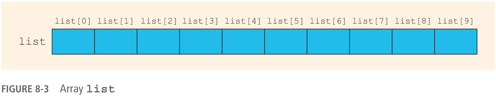

## Objectives (1 of 3)

In this chapter, you will:

- Learn the reasons for arrays
- Explore how to declare and manipulate data into arrays
- Understand the meaning of "array index out of bounds"
- Learn how to declare and initialize arrays
- Become familiar with the restrictions on array processing

## Objectives (2 of 3)

- Discover how to pass an array as a parameter to a function
- Learn how to search an array
- Learn how to sort an array
- Become aware of **auto** declarations
- Learn about **range-based for** loops
- Learn about C-strings

## Objectives (3 of 3)

- Examine the use of string functions to process C-strings
- Discover how to input data into—and output data from—a C-string
- Learn about parallel arrays
- Discover how to manipulate data in a two-dimensional array
- Learn about multidimensional arrays

## Introduction

- **Simple data type** (or **scalar**): variables of these types can store only one value at a time
- **Structured data type**: a data type in which each data item is a collection of other data items

## Comparing Arrays with Discrete Scalar Variables

- Arrays provide a compact, manageable, and efficient way to handle multiple data elements.
- They are particularly useful when dealing with a large number of similar items.
- Enhance code readability, scalability, and maintenance.

## The Problem with Scalar Variables
### Managing Scores of 100 Students

- Imagine declaring 100 different variables:
  - `int score1, score2, score3, ..., score100;`
- Issues:
  1. Code becomes lengthy and hard to read.
  2. Maintenance and updates are difficult.
  3. Highly error-prone.
  4. Not scalable for a variable number of students.
  5. Inefficient for operations like calculating averages.

## The Array Solution
### Simplifying with a Single Data Structure

- Use an array:
  - `int scores[100];`
- Advantages:
  1. Simplifies declaration.
  2. Facilitates easy iteration for operations.
  3. Easily scalable.
  4. Maintains data cohesion.
  5. Efficient for various operations.

## Arrays

- **Array**: a collection of a fixed number of components, all of the same data type
- **One-dimensional array**: components are arranged in a list form
- Syntax for declaring a one-dimensional array

    ```cpp
    dataType arrayName[intExp];
    ```
- **intExp**: any *constant expression* that evaluates to a positive integer
    - Consider using `unsigned` versus `signed` integral expressions. 

- Example:

    ```cpp
    int scores[10];
    int scores[n + 1];
    ```

## Variable-length arrays not permitted{.shrink}

- Arrays must be declared using a constant expression.
- Variable-length arrays (VLAs) are arrays where the length is determined at runtime rather than at compile time (i.e., using a variable to declare the array dimension).
- Variable-Length Arrays (VLAs) are not part of the C++ standard, however some compilers may still support them as an extension to the language. 
    - This is not portable and can lead to undefined behavior according to the C++ standard. 
- Code using VLAs will generate compiler errors (i.e., will not compile) on bellagio.

    ```cpp
    size_t size;
    cout << "Enter the size of the array: ";
    cin >> size;
    
    // declare a Variable-Length Array (VLA)
    int vla[size];      // ERROR - this will not compile
    ```

## Accessing Array Components (1 of 3)

- General syntax

    ```cpp
    arrayName[indexExp];
    ```

- **indexExp**: called the index
    - An expression with a nonnegative integer value
- Value of the index is the position of the item in the array
- `[]`: **array subscript operator**
    - Array index always starts at 0
    - Similar to using `at()` with strings, but there is no protection from out-of-bounds access

## Accessing Array Components (2 of 3){.shrink}

This statement declares an array of 10 components: 

```cpp
int list[10];
```




```cpp
list[5] = 34;  // stores 34 in list[5], the sixth component of the array list
```


## Accessing Array Components (3 of 3)

```cpp
list[3] = 10;
list[6] = 35;
list[5] = list[3] + list[6];
```


## Processing Dimensional Arrays (1 of 3)

- Basic operations on a one-dimensional array include:
    - Initializing
    - Inputting data
    - Outputting data stored in an array
    - Finding the largest and/or smallest element
- Each operation requires ability to step through elements of the array
    - Easily accomplished using a loop

## Processing One-Dimensional Arrays (2 of 3)

- Given the declaration:

    ```cpp
    int list[100];  // list is an array of 100 ints
    ```

- Use a `for` loop to access array elements:

    ```cpp
    for (size_t i = 0; i < 100; ++i) {    // Line 1 
        cin >> list[i];                     // Line 2
    }
    ```

## Best practices{.shrink}

### Use of `std::size_t` when working with arrays

- `std::size_t` is a type defined in the C++ standard library, commonly used for representing sizes and counts in a platform-independent way. It is an unsigned integer type and is typically used for array indexing, loop counting, and specifying the size of objects.

- Using `std::size_t` is a best practice for loop counting and indexing into arrays and containers, as it ensures that the type used is capable of representing the full range of possible sizes on the platform.

## Processing One-Dimensional Arrays (3 of 3)

- Loops are used to process arrays
    - Initializing an array
    - Reading data into an array
    - Printing an array
    - Finding the sum and average of an array
    - Finding the largest element in an array

## Processing One-Dimensional Arrays
### Initializing an array

```cpp
double sales[10];

// a. Initializing an array
for (size_t index = 0; index < 10; ++index) {
    sales[index] = 0.0;
}
```

## Processing One-Dimensional Arrays
### Reading data into an array

```cpp
double sales[10];

// b. Reading data into memory
for (size_t index = 0; index < 10; ++index) {
    cin >> sales[index];
}
```

## Processing One-Dimensional Arrays
### Printing an array

```cpp
double sales[10];

// c. Printing an array
for (size_t index = 0; index < 10; ++index) {
    cout << sales[index] << ' ';
}

cout << '\n';
```

## Processing One-Dimensional Arrays
### Finding the sum and average of an array

```cpp
double sales[10];
double sum = 0.0;
double average;

// d. Finding the sum and average of an array
for (size_t index = 0; index < 10; ++index) {
    sum += sales[index];
}

average = sum / 10.0;
```

## Processing One-Dimensional Arrays
### Finding the largest element in an array

```cpp
double sales[10];
double largestSale;
size_t maxIndex = 0;

// e. Finding the largest element in an array
for (size_t index = 1; index < 10; ++index) {
    if (sales[maxIndex] < sales[index]) {
        maxIndex = index;
    }
}

largestSale = sales[maxIndex];
```

## Array Index Out of Bounds

- The index of an array is **in bounds** if the index is between 0 and `ARRAY_SIZE - 1`
    - Otherwise, the index is out of bounds
- In C++, there is no guard against indices that are out of bounds
    - This check is solely the programmer’s responsibility!

## Array Initialization During Declaration

- Arrays can be initialized during declaration

    – Values are placed between curly braces

- Example 1 

    ```cpp
    double sales[5] = { 12.25, 32.50, 16.90, 23, 45.68 };
    ```

- Example 2: the array size is determined by the number of initial values in the braces if the array is declared without size specified

    ```cpp
    double sales[] = { 12.25, 32.50, 16.90, 23, 45.68 };
    ```

## Partial Initialization of Arrays During Declaration

- The statement:

    ```cpp
    int list[10] = { 0 };
    ```

- Declares an array of 10 components and initializes all of them to zero
- The statement (an example of partial initialization of an array during declaration):

    ```cpp
    int list[10] = { 8, 5, 12 };
    ```

- Declares an array of 10 components and initializes `list[0]` to 8, `list[1]` to 5, `list[2]` to 12
- All other components are initialized to 0

## Some Restrictions on Array Processing

- **Aggregate operation**: any operation that manipulates the entire array as a single unit
    - Not allowed on arrays in C++
- Example

    ```cpp
    int myList[5] = { 0, 4, 8, 12, 16 };  // Line 1
    int yourList[5];                      // Line 2 
    
    yourList = myList;                    // illegal!
    ```

- Solution - use a loop to copy elements

    ```cpp
    for (size_t i = 0; i < 5; ++i) {
        yourList[i] = myList[i];
    }
    ```

## Arrays as Parameters to Functions

- Arrays are passed by reference only
- Do not use symbol `&` when declaring an array as a formal parameter
- The size of the array is usually omitted in the array parameter
    - If provided, it is ignored by the compiler
- The following example illustrates a function prototype, which includes an array parameter and a parameter specifying the number of elements in the array:

    ```cpp
    void initialize(int list[], size_t listSize);
    ```

## Constant Arrays as Formal Parameters

- Can prevent a function from changing the actual parameter when passed by reference
    - Use `const` in the declaration of the formal parameter
- Example 

    ```cpp
    void foo(int x[], const int y[], size_t sizeX, size_t sizeY);
    ```

## Base Address of an Array and Array in Computer Memory (1 of 2)

- The **base address** of an array is the address (memory location) of the first array component
    - If list is a one-dimensional array, its base address is the address of `list[0]`
- When an array is passed as a parameter, the base address of the actual array is passed to the formal parameter

## Base Address of an Array and Array in Computer Memory (2 of 2){.shrink}


## Functions Cannot Return a Value of the Type Array

- C++ does not allow functions to return a value of type array

## Integral Data Type and Array Indices

- C++ allows any integral type to be used as an array index
    - Improves code readability
- The following code illustrates improved readability:

    ```cpp
    enum paintType { 
        GREEN, RED, BLUE, BROWN, WHITE, ORANGE, YELLOW, NUM_PAINTS
    };
    double paintSale[NUM_PAINTS];

    paintSale[RED] = paintSale[RED] + 75.69;
    ```

## Other Ways to Declare Arrays

- Example 1

    ```cpp
    const size_t NO_OF_STUDENTS = 20;
    int testScores[NO_OF_STUDENTS];
    ```
    
- Example 2

    ```cpp
    const size_t SIZE = 50;     // Line 1
    using list = double[SIZE];  // Line 2
    list yourList;              // Line 3
    list myList;                // Line 4
    ```

## Searching an Array for a Specific Item (1 of 2)

- **Sequential search** (or **linear search**)
    - Searching a list for a given item, starting from the first array element
    - Compare each element in the array with value that is being searched
    - Continue the search until item is found or no more data is left in the list

## Searching an Array for a Specific Item (2 of 2)

```cpp
size_t seqSearch(const int list[], size_t listLength, int searchItem) {
    size_t loc   = 0;
    bool   found = false;
    
    while (loc < listLength && !found) {
        if (list[loc] == searchItem) {
            found = true;
        } else {
            ++loc;
        }
    }
    
    return found ? loc : -1;
}
```

## Sorting

- **Selection sort**: rearrange the list by selecting an element and moving it to its proper position
- Steps for a selection sort:
    - Find the smallest element in the unsorted portion of the list
    - Move it to the top of the unsorted portion by swapping with the element currently there
    - Start again with the rest of the list

## Selection Sort (1 of 3)


## Selection Sort (2 of 3)


## Selection Sort (3 of 3){.shrink}

```cpp
void selectionSort(int list[], size_t length) {
    for (size_t index = 0; index < length - 1; ++index) {
        size_t smallestIndex = index;

        // step a
        for (size_t location = index + 1; location < length; ++location) {
            int temp;

            if (list[location] < list[smallestIndex]) {
                smallestIndex = location;
            }

            // step b
            temp = list[smallestIndex];
            list[smallestIndex] = list[index];
            list[index] = temp;
        }
    }
}
```

## Auto Declaration and Range-Based for Loops{.shrink}

- Modern C++ allows **auto** declaration of variables
– Data type does not need to be specified 

    ```cpp
    auto num   = 15;     // num is an int
    auto value = 42.75;  // value is a double
    auto ch    = 'A';    // ch is a char
    ```

    The compiler deduces the type based on the type of the expression on the righthand side of the assignment operator.

- Range-based for loop

    ```cpp
    double list[25];
    double sum = 0.0;
    
    for (double num : list) {  // read as "for each num in list"
        sum += num;
    }
    ```

## C-Strings (Character Arrays) (1 of 3)

- A **character array** is an array whose components are of type char
- C-strings are null-terminated (`'\0'`) character arrays
- Examples
    - 'A' is the character A
    - "A" is the C-string A
        - Note: "A" represents two characters, 'A' and '\0'

## Strings (Character Arrays) (2 of 3)

- This is an example of a C-string declaration:

    ```cpp
    char name[16];
    ```

- Since C-strings are null terminated and **name** has 16 components, the largest string it can store has 15 characters
- If you store a string whose length is less than the array size, the last components are unused

## Strings (Character Arrays) (3 of 3)

- The size of an array can be omitted if the array is initialized during declaration

    ```cpp
    char name[] = "John";
    ```

    – Declares an array of length 5 and stores  the C-string "John" in the array
    
- Useful string manipulation functions include:
    * `strcpy`
    * `strncpy`
    * `strlen`
    * `strcmp`

## C-String Functions (1 of 4){.shrink}

1. `strcpy` - This function copies the C-string pointed by `source` into the array pointed by `destination`, including the terminating null character (and stopping at that point).

    ```cpp
    char source[] = "Sample string";
    char destination[50];
    
    strcpy(destination, source);
    
    cout << "Copied string: " << destination << endl;  
    // prints "Sample string"
    ```

## C-String Functions (2 of 4){.shrink}

2. `strncpy` - This function is similar to `strcpy`, but it will copy up to `n` characters from the source to destination. If the length of the source is less than `n`, the remainder of the destination will be padded with null bytes.

    ```cpp
    char source[] = "Sample string";
    char destination[50];
    
    strncpy(destination, source, 6);  // Copies only the first 6 characters
    
    cout << "Copied string: " << destination << endl;  
    // prints "Sample"
    ```

## C-String Functions (3 of 4){.shrink}

3. `strlen` - This function computes the length of the string `str` up to but not including the terminating null character.

    ```cpp
    char str[] = "Sample string";
    
    size_t len = strlen(str);
    
    cout << "Length of string: " << len << endl;
    // prints 13
    ```

## C-String Functions (4 of 4){.shrink}

4. `strcmp` - This function compares the string pointed to, by `str1` to the string pointed to by `str2`.

    ```cpp
    char str1[] = "Hello";
    char str2[] = "World";
    
    int result = strcmp(str1, str2);
    
    if (result < 0) {
        cout << str1 << " is less than " << str2 << endl;
    } else if (result > 0) {
        cout << str1 << " is greater than " << str2 << endl;
    } else {
        cout << str1 << " is equal to " << str2 << endl;
    }
    ```

## String Comparison

- C-strings are compared character by character using the collating sequence of the system
- Comparison rules are identical to those used with `std::string`
- Use the function `strcmp` or `strncmp`
- If using the ASCII character set:
    - `"Air" < "Boat"`
    - `"Air" < "An"`
    - `"Bill" < "Billy"`
    - `"Hello" < "hello"`

## Reading and Writing Strings

- Most rules for arrays also apply to C-strings (which are character arrays)
- Aggregate operations, such as assignment and comparison, are not allowed on arrays
- C++ *does* allow aggregate operations for the input and output of C-strings

## String Input (1 of 2){.shrink}

- This is an example of string input: 

    ```cpp   
    cin >> str;
    ```

    - Stores the next input C-string into name
- To read strings with blanks, use the function `get`:

    ```cpp   
    cin.get(str, m + 1);
    ```

    - When executed , the statement stores the next **m** characters into **str**, but the newline character is not stored in **str**
    - If input string has fewer than **m** characters, reading stops at the newline character

## String Input (2 of 2){.shrink}

**std::setw for input:**

- Sets the number of characters to read for the next input operation.
- Used with `cin` to limit input size.
- Example:

    ```cpp
    char input[6];  // One extra spot for the null terminator

    cout << "Enter a string (up to 5 characters): ";
    cin >> setw(5 + 1); // Set width to 5 characters + 1 for null terminator
    cin >> input;
    ```

## String Output

- Example 

    ```cpp
    cout << name;
    ```
    
- Outputs the content of **name** on the screen
- `<<` continues to write the contents of **name** until it finds the null character
    - If **name** does not contain the null character, then strange output may occur since << continues to output data from memory adjacent to name until a '\0' is found

<!--## Specifying Input/Output Files at Execution Time

- User can specify the name of an input and/or output file at execution time
    
    ```cpp
    cout << "Enter the input file name: ";
    cin >> fileName;
    infile.open(fileName);  // open the input file .
    .
    .
    .
    cout << "Enter the output file name: "; 
    cin >> fileName; 
    outfile.open(fileName);  // open the output file
    ```
    
## string Type and Input/Output Files

- Argument to the open function must be a null-terminated string (a C-string)
    - If using a string variable for the name of an I/O file, the value must first be converted to a C-string before calling **open**
- Use the **c_str** function to convert
- The syntax to use the function c_str is:

    ```cpp
    strVar.c_str()
    ```

- Where **strVar** is a variable of type **string**-->

## Parallel Arrays{.shrink}

- Two (or more) arrays are called **parallel** if their corresponding components hold related information
- The following example illustrates two parallel arrays:

    ```cpp
    int studentId[50];
    char courseGrade[50];
    ```

    With the following sample data to enter into the arrays:
    
    ```
    studentId courseGrade
    23456     A 
    86723     B
    22356     C
    92733     B
    11892     D
    ...       ...
    ```

## Two- and Multidimensional Arrays

- **Two-dimensional array**: a collection of a fixed number of components (of the same type) arranged in two dimensions
    – Sometimes called matrices or tables
- Declaration syntax
    - **intExp1** and **intExp2** are expressions with positive integer values specifying the number of rows and columns in the array

        ```cpp
        dataType arrayName[intExp1][intExp2];
        ```

## Accessing Array Components (1 of 2)

- Syntax to access a component in a two-dimensional array

    ```cpp
    arrayName[indexExp1][indexExp2]
    ```

- Where **indexExp1** and **indexExp2** are expressions with positive integer values, and specify the row and column position
- Example: 

    ```cpp
    sales[5][3] = 25.75;
    ```

## Accessing Array Components (2 of 2)


## Two-Dimensional Array Initialization During Declaration{.shrink}

- Two-dimensional arrays can be initialized when they are declared
    - Elements of each row are enclosed within braces and separated by commas
    - All rows are enclosed within braces
    - For number arrays, unspecified elements are set to 0
- An example of two-dimensional array initialization is shown below:

    ```cpp
    int board[4][3] = {
        {  2,  3,  1 },
        { 15, 25, 13 },
        { 20,  4,  7 },
        { 11, 18, 14 }
    };
    ```

## Two-Dimensional Arrays and Enumeration Types (1 of 2)

- Enumeration types can be used for array indices

    ```cpp
    const size_t NUMBER_OF_ROWS    = 6;
    const size_t NUMBER_OF_COLUMNS = 5;
    int   inStock[NUMBER_OF_ROWS][NUMBER_OF_COLUMNS];
        
    enum carType { GM, FORD, TOYOTA, BMW, NISSAN, VOLVO }; 
    enum colorType { RED, BROWN, BLACK, WHITE, GRAY }; 
    ```

## Two-Dimensional Arrays and Enumeration Types (2 of 2)

```cpp
inStock[FORD][WHITE] = 15;
```


## Processing Two-Dimensional Arrays

- Ways to process a two-dimensional array:
    - Process a single element
    - Process the entire array
    - Process a single row at a time, called **row processing**
    - Process a single column at a time, called **column processing**
- Each row and each column of a two-dimensional array is a one-dimensional array
    - To process, use algorithms similar to processing one-dimensional arrays

## Initialization

- An example initializing **row number 4** (fifth row) to 0:

    ```cpp
    size_t row = 4;
    
    for (size_t col = 0; col < NUMBER_OF_COLUMNS; ++col) {
        matrix[row][col] = 0;
    }
    ```

- An example initializing the **entire matrix** to 0

    ```cpp
    for (size_t row = 0; row < NUMBER_OF_ROWS; ++row)  {
        for (size_t col = 0; col < NUMBER_OF_COLUMNS; ++col) {
            matrix[row][col] = 0;
        }
    }
    ```

## Print

- Use a nested loop to output the components of a two dimensional array

    ```cpp
    for (size_t row = 0; row < NUMBER_OF_ROWS; ++row) { 
        for (size_t col = 0; col < NUMBER_OF_COLUMNS; ++col) {
            cout << setw(5) << matrix[row][col] << ' '; 
            cout << '\n';
        }
    }
    ```

## Input

- An example of adding input to row number 4 (fifth row):

    ```cpp
    size_t row = 4;
    
    for (size_t col = 0; col < NUMBER_OF_COLUMNS; ++col) {
        cin >> matrix[row][col];
    }
    ```

- An example of adding input to each component of matrix:

    ```cpp
    for (size_t row = 0; row < NUMBER_OF_ROWS; ++row) {
        for (size_t col = 0; col < NUMBER_OF_COLUMNS; ++col) {
            cin >> matrix[row][col];
        }
    }
    ```

## Sum by Row

- The following example shows how to find the sum of row number 4:

    ```cpp
    size_t sum = 0;
    size_t row = 4;
    
    for (size_t col = 0; col < NUMBER_OF_COLUMNS; ++col) {
        sum += matrix[row][col];
    }
    ```

## Sum by Column

- The following example illustrates finding the sum of each individual column:

    ```cpp
    // Sum of each individual row 
    for (size_t row = 0; row < NUMBER_OF_ROWS; ++row) {
        sum = 0;
        
        for (size_t col = 0; col < NUMBER_OF_COLUMNS; ++col) {
            sum += matrix[row][col];
        }
        
        cout << "Sum of row " << (row + 1) << " = " << sum << '\n';
    }
    ```

## Largest Element in Each Row and Each Column

- The following example finds the largest element in each row:

    ```cpp
    // Largest element in each row 
    for (size_t row = 0; row < NUMBER_OF_ROWS; ++row) {
        largest = matrix[row][0]; // Assume the first element is largest

        for (size_t col = 1; col < NUMBER_OF_COLUMNS; ++col) {
            if (matrix[row][col] > largest) {
                largest = matrix[row][col];
            }
        
        cout << "The largest element in row " << row << " = " << largest << '\n';
    }
    ```

## Passing Two-Dimensional Arrays as Parameters to Functions{.shrink}

- Two-dimensional arrays are passed by reference as parameters to a function
    - The base address is passed to the formal parameter
- Two-dimensional arrays are stored in **row order form**
- When declaring a two-dimensional array as a formal parameter, omit the size of the first dimension, but not the second

    ```cpp
    void processArray(int arr[][NUM_COLUMNS], size_t rows, size_t cols);
    ```

## Arrays of Strings

- Strings in C++ can be manipulated using either the data type **string** or character arrays (C-strings)

## Arrays of Strings and the string Type

- The example below declares an array of 100 components of type string: 

    ```cpp
    string list[100];
    ```

- Basic operations, such as assignment, comparison, and input/output, can be performed on values of the **string** type
- The data in list can be processed just like any one-dimensional array

## Arrays of Strings and C-Strings (Character Arrays){.shrink}

```cpp
strcpy(list[1], "Snow White");
```
    


## Another Way to Declare a Two-Dimensional Array

- Can use `using` (or `typedef`) to define a two-dimensional array data type:

    ```cpp
    const size_t NUMBER_OF_ROWS    = 20;
    const size_t NUMBER_OF_COLUMNS = 10;
    
    typedef int tableType[NUMBER_OF_ROWS][NUMBER_OF_COLUMNS];
    // or 
    using tableType = int[NUMBER_OF_ROWS][NUMBER_OF_COLUMNS]; 
    ```

- This statement declares an array of 20 rows and 10 columns:

    ```cpp
    tableType matrix;
    ```

## Multidimensional Arrays

- **n-dimensional array**: a collection of a fixed number of elements arranged in n dimensions (n >= 1)
- Declaration syntax

    ```cpp
    dataType arrayName[intExp1][intExp2]...[intExpN];
    ```

- Code to access a component

    ```cpp
    arrayName[indexExp1][indexExp2]...[indexExpN]
    ```

## Quick Review (1 of 4)

- An array is a structured data type with a fixed number of components of the same type
    - Components are accessed using their relative positions in the array
- Elements of a one-dimensional array are arranged in the form of a list
- An array index can be any expression that evaluates to a nonnegative integer
    - Prefer to use `unsigned` integral types to index an array, such as `std::size_t`.
    - Must always be less than the size of the array

## Quick Review (2 of 4)

- The base address of an array is the address of the first array component
- When passing an array as an actual parameter, use only its name
    - Passed by reference only
- A function cannot return an array type value
- Individual array components can be passed as parameters to functions

## Quick Review (3 of 4)

- In C++, C-strings are null terminated and are stored in character arrays
- Commonly used C-string manipulation functions include: `strcpy`, `strncpy`, `strcmp`, `strncmp`, and `strlen`
- Parallel arrays hold related information
- In a two-dimensional array, the elements are arranged in a table form

## Quick Review (4 of 4)

- To access an element of a two-dimensional array, you need a pair of indices: one for row position, one for column position
- In row processing, a two-dimensional array is processed one row at a time
- In column processing, a two-dimensional array is processed one column at a time

## Questions?

<!--EOF--> 