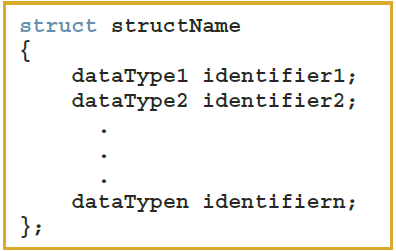
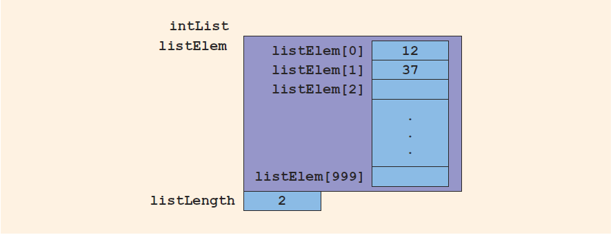

## Objectives (1 of 2)

In this chapter, you will:

- Learn about records (`struct`s)
- Examine various operations on a `struct`
- Explore ways to manipulate data using a `struct`
- Learn about the relationship between a `struct` and functions
- Examine the difference between arrays and `struct`s

## Objectives (2 of 2)

- Discover how arrays are used in a `struct`
- Learn how to create an array of `struct` items
- Learn how to create `struct` within a `struct`

## Records (`struct`s) (1 of 3)

- **struct**: a collection of a fixed number of components in which the components are accessed by name
- The components may be of different types and are called the members of the `struct`
- Syntax

    {height="150px"}

## Records (`struct`s) (2 of 3){.shrink}

- A `struct` is a *definition*, not a declaration
- Must declare a variable of that type to use it

    ```cpp
    struct houseType { 
        string style; 
        int    numOfBedrooms; 
        int    numOfBathrooms; 
        int    numOfCarsGarage; 
        int    yearBuilt; 
        int    finishedSquareFootage; 
        double price; 
        double tax;
    };
    
    // variable declaration - memory allocated
    houseType newHouse;
    ```

## Records (`struct`s) (3 of 3)


## Accessing struct Members (1 of 3)

- Syntax to access a struct member:

    {height="50px"}

- The dot (`.`) is called the **member access operator**

## Accessing struct Members (2 of 3)

```cpp
struct studentType {
    string firstName;
    string lastName;
    char   courseGrade;
    int    testScore;
    int    programmingScore;
    double gpa;
};  // struct studentType

studentType newStudent;
```

## Accessing struct Members (3 of 3)

- To initialize the members of `newStudent`:

    ```cpp
    newStudent.GPA       = 0.0;
    newStudent.firstName = "John";
    newStudent.lastName  = "Brown";
    ```   

{height="130px"}

## Aggregate Initialization

- Example:

    ```cpp
    struct colorType {
        short red;
        short green;
        short blue;
    };  // struct colorType
    
    colorType color = { 255, 0, 0 };  // color red
    ```

## Direct Default Initialization{.shrink}

- Direct Default Initialization
    - Example:

        ```cpp
        struct pointType {
            float x = 0;
            float y = 0;
        };  // struct pointType
        
        pointType p1;  // p1 is initialized with x = 0 and y = 0
        ```

- Overriding Default Values

    - Example:

        ```cpp
        pointType p2 = { 1, 2 };  // p2 is initialized with x = 1 and y = 2
        ```

## Assignment (1 of 2)

- Value of one struct variable can be assigned to another struct variable of the same type using an assignment statement
- The statement: 

    ```cpp
    student = newStudent;
    ```
    
    copies the contents of `newStudent` into `student`

## Assignment (2 of 2)

- The assignment statement:

    ```cpp
    student = newStudent;
    ```

- is equivalent to the following statements:

    ```cpp
    student.firstName        = newStudent.firstName; 
    student.lastName         = newStudent.lastName; 
    student.courseGrade      = newStudent.courseGrade; 
    student.testScore        = newStudent.testScore;
    student.programmingScore = newStudent.programmingScore; 
    student.GPA              = newStudent.GPA;
    ```

## Comparison (Relational Operators)

- Compare struct variables member-wise
    - No aggregate relational operations are allowed
- To compare the values of `student` and `newStudent`:

    ```cpp
    if (student.firstName == newStudent.firstName &&
        student.lastName  == newStudent.lastName) { 
        .
        .
        .
    ```
    
## Input/Output

- No aggregate input/output operations are allowed on a `struct` variable 
- Data in a `struct` variable must be read or written one member at a time
- The following code would output `newStudent` contents:

    ```cpp
    cout << newStudent.firstName        << ' ' 
         << newStudent.lastName         << ' ' 
         << newStudent.courseGrade      << ' ' 
         << newStudent.testScore        << ' ' 
         << newStudent.programmingScore << ' ' 
         << newStudent.GPA 
         << endl;
    ```

## struct Variables and Functions

- A `struct` variable can be passed as a parameter by value or by reference
- A function can return a value of type `struct`
- The following function displays the contents a `struct` variable of type `studentType`:

    ```cpp
    void printStudent(const studentType& student) {
        cout << student.firstName        << ' ' 
             << student.lastName         << ' ' 
             << student.courseGrade      << ' '
             << student.testScore        << ' '
             << student.programmingScore << ' '
             << student.GPA 
             << endl;
    }
    ```

## Arrays versus structs

**TABLE 9-1 Arrays vs. structs**

| Data Type | Array | `struct` |
| - | - | - |
| Arithmetic        | No | No |
| Assignment        | No | Yes | 
| Input/output      | No (except strings) | No | 
| Comparison        | No | No | 
| Parameter passing | By reference only | By value or by reference  | 
| Function returning a value | No | Yes | 

## Arrays in `struct`s (1 of 5){.shrink}

- Two items are associated with a list:
    - Values (elements)
    - Length of the list
- Define a `struct` containing both items:

    ```cpp
    struct listType {
        static const size_t ARRAY_SIZE = 1000;
        
        int    listElem[ARRAY_SIZE];  // array containing the list
        size_t listLength;            // length of the list
    };  // struct listType
    ```
    
- This simple concept of grouping an array and its size together forms the basis of most of cs202.

## Arrays in `struct`s (2 of 5)


## Arrays in `struct`s (3 of 5){.shrink}

- Consider these statements and refer to the figure below showing the results following execution of the statements:

    ```cpp
    intList.listLength  = 0;   // Line 1
    intList.listElem[0] = 12;  // Line 2
    intList.listLength++;      // Line 3
    intList.listElem[1] = 37;  // Line 4
    intList.listLength++;      // Line 5
    ```
    
## Arrays in `struct`s (4 of 5){.shrink}
    
{height="150"}

## Arrays in `struct`s (5 of 5){.shrink}

- `listType` as a container of integers

    ```cpp
    listType list1 {{ 0 }, 0};       // empty container
    listType list2 {{ 12, 37 }, 2};  // container with 2 values
        
    list1 = list2;                   // copy assignment
    
    // print list1 values
    for (size_t i = 0; i < list1.listLength; ++i) {
        cout << list1.listElem[i] << ' ';
    }
    
    cout << endl;
    ```

## structs in Arrays (1 of 2)

- Example

    ```cpp
    struct employeeType { 
        string firstName;
        string lastName;
        int    personID;
        string deptID;
        double yearlySalary;
        double monthlySalary;
        double yearToDatePaid;
        double monthlyBonus;
    };  // struct employeeType
    ```

## structs in Arrays (2 of 2){.shrink}

```cpp
employeeType employees[50];
```

- Declares the array `employees` of 50 components of type `employeeType`


## `struct`s within a `struct` (1 of 2){.shrink}

{height="240px"}

## `struct`s within a `struct` (2 of 2){.shrink}

```cpp
struct dateType {
    int month;
    int day;
    int year;
};  // struct dateType

struct employeeType {
    struct name {
        string first;
        string middle;
        string last;
    };  // struct name
    string empId;
    struct address {
        string address1;
        string address2;
        string city;
        string state;
        string zip;
    };  // struct address
    dateType hireDate;
    dateType quitDate;
    struct contact {
        string phone;
        string cellphone;
        string fax;
        string pager;
        string email;
    };  // struct contact
    string deptID;
    double salary;
};  // struct employeeType
```

## `structs` in Real-World Applications{.shrink}

- Data Modeling
    - Use Case: Representing complex data like a user profile in a software application.
    - Example: A `struct` to model a user with various attributes.
- Systems Programming
    - Use Case: Low-level operations like file handling or network communications.
    - Example: `structs` representing data packets or file headers.
- Game Development
    - Use Case: Managing game entities like characters, levels, or inventory items.
    - Example: A `struct` to represent a game character with attributes like health, position, and inventory.

## Quick Review (1 of 2)

- A `struct` is a collection of a fixed number of components
- Components of a `struct` can be of different types
    - Called members
    - Accessed by name
- `struct` is a reserved word
- No memory is allocated for a `struct`
    - Memory is allocated only when variables are declared

## Quick Review (2 of 2)

- In C++, the dot (.) operator is called the member access operator
    - Used to access members of a struct
- The only built-in operations on a `struct` are the assignment (`=`) and member access (`.`) operations
- Neither arithmetic nor relational operations are allowed on structs
- A `struct` can be passed by value or reference
- A function can return a value of type `struct`
- A `struct` can be a member of another `struct`

## Questions?

<!--EOF-->
